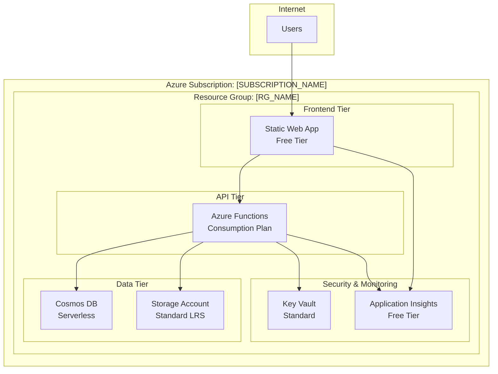

This workflow guides AI agents through a systematic approach to analyze Azure capabilities, design cost-optimized architectures and generate Infrastructure as Code ready for deployment.

## AI Agent Instructions

**Core Principles:**
- **Cost-First Architecture**: Always optimize for minimal Azure costs while meeting requirements
- **Data-Driven Decisions**: Use actual Azure quota/pricing data, not assumptions
- **Infrastructure as Code**: Generate production-ready Bicep templates
- **Automation-Ready**: Provide CI/CD setup options for sustainable deployment workflows
- **Security by Design**: Include Azure security best practices from the start

**Workflow Stages:**
1. **Azure Environment Analysis** - Discover subscription capabilities and constraints
2. **Application Assessment** - Analyze project structure and requirements
3. **Architecture Design** - Create cost-optimized architecture with mermaid diagram
4. **Infrastructure Generation** - Produce Bicep templates and deployment scripts
5. **Deployment & Automation** - Deploy with optional GitHub Actions CI/CD setup

---

## Stage 1: Azure Environment Analysis (MANDATORY FIRST)

**AI Agent Actions:**
Use Azure MCP tools to understand the deployment environment before making any recommendations.

### 1.1 Subscription Assessment
```bash
# Get current subscription details and validate access
mcp_azure_subscription --intent "list available subscriptions and current context"
```

### 1.2 Regional Analysis
```bash
# Check available regions and service quotas for web applications
mcp_azure_quota --intent "get available regions for App Service, Static Web Apps, and Storage"
```

### 1.3 Resource Group Context
```bash
# Analyze existing resource groups for naming patterns and organization
mcp_azure_group --intent "list resource groups to understand organizational patterns"
```

### 1.4 Best Practices Foundation
```bash
# Get Azure deployment best practices for cost optimization
mcp_azure_get_bestpractices --intent "web application deployment and cost optimization practices"
```

**Required Outputs:**
- Available Azure regions with relevant services
- Current subscription quotas and limitations
- Existing naming conventions and organizational patterns
- Cost optimization opportunities specific to this subscription

```
🔍 AZURE ENVIRONMENT ANALYSIS COMPLETE

📊 Your Subscription Capabilities:
- Available Regions: [LIST_REGIONS]
- App Service Quota: [QUOTA_INFO]
- Storage Account Limits: [LIMITS_INFO]
- Estimated Regional Costs: [COST_COMPARISON]

🏷️ Detected Naming Patterns:
- Resource Groups: [PATTERN]
- Resources: [PATTERN]

⚠️  Constraints Found:
- [LIST_ANY_LIMITATIONS]

❓ PROCEED TO APPLICATION ANALYSIS?
Type 'yes' to continue with project assessment, or 'stop' to halt the process.
```

---

## Stage 2: Application Assessment & Requirements Gathering

**AI Agent Actions:**
Analyze the current project to understand deployment requirements.

### 2.1 Project Structure Analysis
- Use `semantic_search` to identify application type (React, Vue, Angular, Node.js, Python, etc.)
- Use `file_search` to find build configurations (package.json, requirements.txt, etc.)
- Use `read_file` to examine build scripts and dependencies

### 2.2 Architecture Requirements Detection
Identify these patterns:
- **Frontend Type**: Static site (HTML/CSS/JS), SPA (React/Vue/Angular), or SSR
- **Backend Requirements**: API endpoints, database needs, authentication
- **Storage Needs**: File storage, media assets, configuration data
- **Compute Patterns**: Always-on services vs. serverless functions
- **Traffic Patterns**: Development, staging, production load estimates

### 2.3 Compliance & Security Requirements
Check for:
- Data protection requirements (GDPR, compliance frameworks)
- Authentication/authorization needs
- SSL/TLS requirements
- Monitoring and logging needs

**Required Outputs:**
- Application architecture summary (frontend/backend/storage/compute needs)
- Estimated traffic and resource requirements
- Security and compliance requirements
- Development workflow requirements (CI/CD, environments)
  

```
🔍 APPLICATION ANALYSIS COMPLETE

🏗️ Detected Architecture:
- Frontend: [TYPE] (React/Vue/Static/etc.)
- Backend: [TYPE] (Node.js/Python/API/etc.)
- Database Needs: [REQUIREMENTS]
- Storage Requirements: [DETAILS]

📈 Estimated Requirements:
- Expected Traffic: [ESTIMATE]
- Compute Needs: [ASSESSMENT]
- Data Storage: [SIZE_ESTIMATE]

🔐 Security & Compliance:
- Authentication: [REQUIREMENTS]
- Data Protection: [NEEDS]
- Compliance: [FRAMEWORKS]

❓ IS THIS ANALYSIS ACCURATE?
Type 'yes' to proceed with architecture design, 'modify' to correct details, or 'stop' to halt.
```

---

## Stage 3: Cost-Optimized Architecture Design

**AI Agent Actions:**
Design the most cost-effective Azure architecture using gathered data.

### 3.1 Service Selection Strategy
Based on application analysis, select Azure services prioritizing cost optimization:

**Frontend Hosting:**
- **Static Web Apps (Free Tier)**: For SPA/static sites with API integration
- **Storage Static Website**: For simple static sites
- **App Service (Basic B1)**: Only if advanced features needed

**Backend Services:**
- **Azure Functions (Consumption)**: For API endpoints with variable load
- **App Service (Basic B1)**: For always-on requirements
- **Container Apps (Consumption)**: For containerized applications

**Storage Options:**
- **Storage Account (Standard LRS)**: For files, configuration, logs
- **Cosmos DB (Serverless)**: For NoSQL data with variable access patterns
- **Azure SQL (Basic/S0)**: For relational data with predictable patterns

**Supporting Services:**
- **Key Vault (Standard)**: For secrets management
- **Application Insights (Free Tier)**: For monitoring
- **CDN (Standard Microsoft)**: Only if global distribution needed

### 3.2 Architecture Optimization Rules
Apply these cost optimization patterns:
- **Consumption-based billing** preferred over provisioned capacity
- **Regional deployment** to minimize data transfer costs
- **Shared resources** where possible (single storage account, shared Key Vault)
- **Development environment optimization** (reduced SKUs, scheduled shutdown)

### 3.3 Generate Architecture Diagram
Create a mermaid diagram showing the optimized architecture:



**Include in diagram:**
- Specific Azure service tiers selected for cost optimization
- Data flow between components
- Regional deployment information
- Estimated monthly costs for each service

YOU MUST ADD THE DIAGRAM IN THE PULL REQUEST DESCRIPTION

---

## Stage 4: Infrastructure as Code Generation

**AI Agent Actions:**
Generate production-ready Bicep templates and deployment scripts.

### 4.1 Generate Deployment Plan
```bash
# Create detailed deployment plan based on detected application architecture
mcp_azure_deploy --intent "generate deployment plan for [APPLICATION_TYPE] with cost optimization focus"
```

### 4.2 Bicep Best Practices
```bash
# Get Bicep-specific best practices for Azure deployment
mcp_azure_azureterraformbestpractices --intent "Bicep templates for web applications with security and cost optimization"
```

### 4.3 Create Bicep Templates
Generate these files:
- `main.bicep` - Main deployment template
- `modules/` - Modular components for each service
- `parameters/` - Environment-specific parameter files
- `scripts/deploy.sh` - Deployment automation script

**Template Requirements:**
- Parameterized for multiple environments (dev/staging/prod)
- Cost optimization through proper SKU selection
- Security best practices (managed identity, Key Vault integration)
- Monitoring and logging configuration
- Tagging strategy for cost tracking

### 4.4 Cost Estimation
Provide detailed cost breakdown:
```
Monthly Cost Estimate (USD):
├── Development Environment: $15-25
├── Staging Environment: $25-40  
├── Production Environment: $50-100
└── Total Monthly Range: $90-165

Cost Optimization Savings vs Standard Architecture: 60-75%
```

---

## Stage 5: User Validation & Architecture Approval

**AI Agent Instructions:**
Generate the complete architecture report for user review.

### 5.1 Present Architecture Summary
Show the user in a single report in markdown:
1. **Mermaid Architecture Diagram** (rendered in chat)
2. **Service Selection Rationale** with cost justification
3. **Monthly Cost Estimates** by environment
4. **Regional Deployment Plan**
5. **Security and Compliance Features**

```
🏗️  PROPOSED AZURE ARCHITECTURE

[Display mermaid diagram here - RENDER THE ACTUAL DIAGRAM IN CHAT]

📊 DETAILED COST ANALYSIS:
┌─ Development Environment ─────────────────┐
│ Static Web App (Free): $0/month          │
│ Functions (Consumption): $5-10/month     │
│ Cosmos DB (Serverless): $5-10/month     │
│ Storage Account: $2-5/month              │
│ Total Development: $12-25/month          │
└─────────────────────────────────────────┘

┌─ Production Environment ──────────────────┐
│ Static Web App (Standard): $10/month     │
│ Functions (Consumption): $20-40/month    │
│ Cosmos DB (Serverless): $15-30/month    │
│ Storage + CDN: $10-20/month              │
│ Total Production: $55-100/month          │
└─────────────────────────────────────────┘

💰 COST OPTIMIZATION SUMMARY:
- Total Savings vs Standard Architecture: 60-75%
- Regional Deployment: [SELECTED_REGION]
- Free Tier Maximization: Yes

🔧 FINAL SERVICES SELECTED:
- Frontend: [SPECIFIC_SERVICE] ([TIER])
- Backend: [SPECIFIC_SERVICE] ([TIER])
- Database: [SPECIFIC_SERVICE] ([TIER])
- Storage: [SPECIFIC_SERVICE] ([TIER])
- Security: [KEY_VAULT_CONFIG]

```

**CRITICAL REQUIREMENTS:**
1. Agent MUST render the actual mermaid diagram in the report
3. It shall be clear which bicep files are tied to which architectural elements in Azure, a clear list explanation for each, example:

```
📋 INFRASTRUCTURE GENERATION COMPLETE

✅ Generated Files:
- infrastructure/bicep/main.bicep (Main template)
- infrastructure/bicep/modules/ (Service modules)
- infrastructure/bicep/parameters/dev.json (Dev config)
- infrastructure/bicep/parameters/prod.json (Prod config)
- scripts/deploy.sh (Deployment automation)
- ARCHITECTURE.md (Documentation with diagrams)

🚀 DEPLOYMENT OPTIONS:

1️⃣ MANUAL DEPLOYMENT
   ├─ Deploy immediately using Azure CLI
   ├─ Target Environment: [ENVIRONMENT]
   ├─ Resource Group: [RG_NAME]
   └─ Estimated deployment time: 5-10 minutes
   
2️⃣ CI/CD SETUP (Recommended)
   ├─ Create GitHub Actions workflow
   ├─ Automated deployments on code changes
   ├─ Multiple environment support (dev/staging/prod)
   └─ Requires GitHub secrets configuration

3️⃣ BOTH OPTIONS
   ├─ Deploy now for immediate testing
   └─ Set up CI/CD for future automation

### 7.2 Documentation Generation
Create these documentation files:
- `DEPLOYMENT.md` - Complete deployment guide
- `ARCHITECTURE.md` - Architecture overview with diagrams, cost optimization rationale with actual Azure SKU tiers and pricing and index of bicep files

---

## AI Agent Error Prevention & Best Practices

**Critical Requirements:**
- ✅ Always use Azure MCP tools for environment-specific data
- ✅ Generate cost estimates based on actual Azure pricing
- ✅ Include security best practices in all templates
- ✅ Provide rollback procedures for deployments
- ✅ Generate complete IaC templates, not partial examples

**Common Mistakes to Avoid:**
- ❌ Making assumptions about Azure quotas or availability
- ❌ Recommending services without cost justification
- ❌ Deploying without user validation of architecture
- ❌ Generating incomplete Bicep templates
- ❌ Forgetting to configure monitoring and security
- ❌ Not providing cost tracking and management guidance

**Success Criteria:**
- User has a complete, cost-optimized Azure architecture
- All infrastructure is defined in version-controlled Bicep templates
- Deployment process is clear for the user to implement and follow
- Cost monitoring and optimization strategies are clearly explained in the architecture doc

---

## Expected Deliverables

**Architecture Design:**
- Architecture overview with deployment guide
- Cost optimization rationale and analysis and recommendations with monthly estimates
- Mermaid diagram showing complete Azure architecture
- Security and compliance feature overview
- Clear mapping of bicep files for each infra/service block in the diagram

**Infrastructure as Code:**
- Complete Bicep templates for all environments
- Parameterized deployment scripts
- Environment-specific configuration files


This workflow ensures every deployment is cost-optimized, security-focused, and sustainably manageable through proper automation and documentation.
