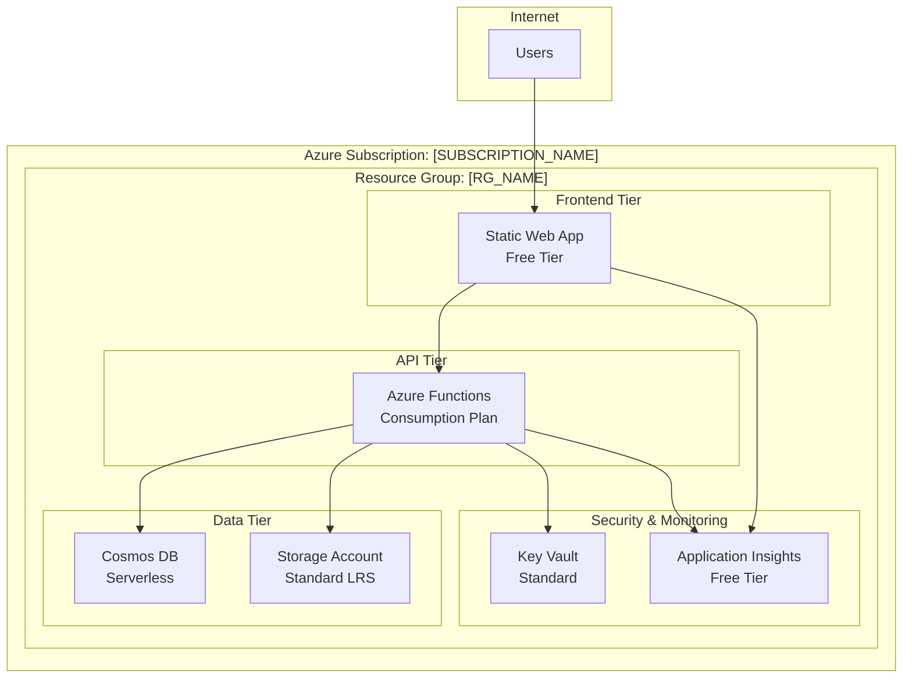

# Azure Deployment Optimizer: Cost-Effective Architecture & Automated Deployment

This workflow guides AI agents through a systematic approach to analyze Azure capabilities, design cost-optimized architectures, generate Infrastructure as Code, and deploy applications with optional CI/CD automation.

## AI Agent Instructions

**Core Principles:**
- **Cost-First Architecture**: Always optimize for minimal Azure costs while meeting requirements
- **Data-Driven Decisions**: Use actual Azure quota/pricing data, not assumptions
- **Infrastructure as Code**: Generate production-ready Bicep templates
- **Automation-Ready**: Provide CI/CD setup options for sustainable deployment workflows
- **Security by Design**: Include Azure security best practices from the start

**Workflow Stages:**
1. **Azure Environment Analysis** - Discover subscription capabilities and constraints
2. **Application Assessment** - Analyze project structure and requirements
3. **Architecture Design** - Create cost-optimized architecture with mermaid diagram
4. **Infrastructure Generation** - Produce Bicep templates and deployment scripts
5. **Deployment & Automation** - Deploy with optional GitHub Actions CI/CD setup

---

## Stage 1: Azure Environment Analysis (MANDATORY FIRST)

**AI Agent Actions:**
Use Azure MCP tools to understand the deployment environment before making any recommendations.

### 1.1 Subscription Assessment
```bash
# Get current subscription details and validate access
mcp_azure_subscription --intent "list available subscriptions and current context"
```

### 1.2 Regional Analysis
```bash
# Check available regions and service quotas for web applications
mcp_azure_quota --intent "get available regions for App Service, Static Web Apps, and Storage"
```

### 1.3 Resource Group Context
```bash
# Analyze existing resource groups for naming patterns and organization
mcp_azure_group --intent "list resource groups to understand organizational patterns"
```

### 1.4 Best Practices Foundation
```bash
# Get Azure deployment best practices for cost optimization
mcp_azure_get_bestpractices --intent "web application deployment and cost optimization practices"
```

**Required Outputs:**
- Available Azure regions with relevant services
- Current subscription quotas and limitations
- Existing naming conventions and organizational patterns
- Cost optimization opportunities specific to this subscription

### 🛑 MANDATORY USER VALIDATION CHECKPOINT 1

**YOU MUST present findings and get user approval before proceeding:**

```
🔍 AZURE ENVIRONMENT ANALYSIS COMPLETE

📊 Your Subscription Capabilities:
- Available Regions: [LIST_REGIONS]
- App Service Quota: [QUOTA_INFO]
- Storage Account Limits: [LIMITS_INFO]
- Estimated Regional Costs: [COST_COMPARISON]

🏷️ Detected Naming Patterns:
- Resource Groups: [PATTERN]
- Resources: [PATTERN]

⚠️  Constraints Found:
- [LIST_ANY_LIMITATIONS]

❓ PROCEED TO APPLICATION ANALYSIS?
Type 'yes' to continue with project assessment, or 'stop' to halt the process.
```

**CRITICAL: You must ASK AND WAIT for explicit user confirmation before proceeding to Stage 2.**

---

## Stage 2: Application Assessment & Requirements Gathering

**AI Agent Actions:**
Analyze the current project to understand deployment requirements.

### 2.1 Project Structure Analysis
- Use `semantic_search` to identify application type (React, Vue, Angular, Node.js, Python, etc.)
- Use `file_search` to find build configurations (package.json, requirements.txt, etc.)
- Use `read_file` to examine build scripts and dependencies

### 2.2 Architecture Requirements Detection
Identify these patterns:
- **Frontend Type**: Static site (HTML/CSS/JS), SPA (React/Vue/Angular), or SSR
- **Backend Requirements**: API endpoints, database needs, authentication
- **Storage Needs**: File storage, media assets, configuration data
- **Compute Patterns**: Always-on services vs. serverless functions
- **Traffic Patterns**: Development, staging, production load estimates

### 2.3 Compliance & Security Requirements
Check for:
- Data protection requirements (GDPR, compliance frameworks)
- Authentication/authorization needs
- SSL/TLS requirements
- Monitoring and logging needs

**Required Outputs:**
- Application architecture summary (frontend/backend/storage/compute needs)
- Estimated traffic and resource requirements
- Security and compliance requirements
- Development workflow requirements (CI/CD, environments)

### 🛑 MANDATORY USER VALIDATION CHECKPOINT 2

**YOU MUST present application analysis and get user confirmation:**

```
🔍 APPLICATION ANALYSIS COMPLETE

🏗️ Detected Architecture:
- Frontend: [TYPE] (React/Vue/Static/etc.)
- Backend: [TYPE] (Node.js/Python/API/etc.)
- Database Needs: [REQUIREMENTS]
- Storage Requirements: [DETAILS]

📈 Estimated Requirements:
- Expected Traffic: [ESTIMATE]
- Compute Needs: [ASSESSMENT]
- Data Storage: [SIZE_ESTIMATE]

🔐 Security & Compliance:
- Authentication: [REQUIREMENTS]
- Data Protection: [NEEDS]
- Compliance: [FRAMEWORKS]

❓ IS THIS ANALYSIS ACCURATE?
Type 'yes' to proceed with architecture design, 'modify' to correct details, or 'stop' to halt.
```

**CRITICAL: You must ASK AND WAIT for explicit user confirmation ('yes') before proceeding to Stage 3.**

---

## Stage 3: Cost-Optimized Architecture Design

**AI Agent Actions:**
Design the most cost-effective Azure architecture using gathered data.

### 3.1 Service Selection Strategy
Based on application analysis, select Azure services prioritizing cost optimization:

**Frontend Hosting:**
- **Static Web Apps (Free Tier)**: For SPA/static sites with API integration
- **Storage Static Website**: For simple static sites
- **App Service (Basic B1)**: Only if advanced features needed

**Backend Services:**
- **Azure Functions (Consumption)**: For API endpoints with variable load
- **App Service (Basic B1)**: For always-on requirements
- **Container Apps (Consumption)**: For containerized applications

**Storage Options:**
- **Storage Account (Standard LRS)**: For files, configuration, logs
- **Cosmos DB (Serverless)**: For NoSQL data with variable access patterns
- **Azure SQL (Basic/S0)**: For relational data with predictable patterns

**Supporting Services:**
- **Key Vault (Standard)**: For secrets management
- **Application Insights (Free Tier)**: For monitoring
- **CDN (Standard Microsoft)**: Only if global distribution needed

### 3.2 Architecture Optimization Rules
Apply these cost optimization patterns:
- **Consumption-based billing** preferred over provisioned capacity
- **Regional deployment** to minimize data transfer costs
- **Shared resources** where possible (single storage account, shared Key Vault)
- **Development environment optimization** (reduced SKUs, scheduled shutdown)

### 3.3 Generate Architecture Diagram
Create a mermaid diagram showing the optimized architecture:



**Include in diagram:**
- Specific Azure service tiers selected for cost optimization
- Data flow between components
- Regional deployment information
- Estimated monthly costs for each service

---

## Stage 4: Infrastructure as Code Generation

**AI Agent Actions:**
Generate production-ready Bicep templates and deployment scripts.

### 4.1 Generate Deployment Plan
```bash
# Create detailed deployment plan based on detected application architecture
mcp_azure_deploy --intent "generate deployment plan for [APPLICATION_TYPE] with cost optimization focus"
```

### 4.2 Bicep Best Practices
```bash
# Get Bicep-specific best practices for Azure deployment
mcp_azure_azureterraformbestpractices --intent "Bicep templates for web applications with security and cost optimization"
```

### 4.3 Create Bicep Templates
Generate these files:
- `main.bicep` - Main deployment template
- `modules/` - Modular components for each service
- `parameters/` - Environment-specific parameter files
- `scripts/deploy.sh` - Deployment automation script

**Template Requirements:**
- Parameterized for multiple environments (dev/staging/prod)
- Cost optimization through proper SKU selection
- Security best practices (managed identity, Key Vault integration)
- Monitoring and logging configuration
- Tagging strategy for cost tracking

### 4.4 Cost Estimation
Provide detailed cost breakdown:
```
Monthly Cost Estimate (USD):
├── Development Environment: $15-25
├── Staging Environment: $25-40  
├── Production Environment: $50-100
└── Total Monthly Range: $90-165

Cost Optimization Savings vs Standard Architecture: 60-75%
```

---

## Stage 5: User Validation & Architecture Approval

**AI Agent Instructions:**
Present the complete architecture for user review BEFORE proceeding to deployment.

### 5.1 Present Architecture Summary
Show the user:
1. **Mermaid Architecture Diagram** (rendered in chat)
2. **Service Selection Rationale** with cost justification
3. **Monthly Cost Estimates** by environment
4. **Regional Deployment Plan**
5. **Security and Compliance Features**

### 🛑 MANDATORY USER VALIDATION CHECKPOINT 3 (ARCHITECTURE APPROVAL)

**AI Agent MUST get explicit architecture approval before generating any infrastructure code:**

```
🏗️  PROPOSED AZURE ARCHITECTURE

[Display mermaid diagram here - RENDER THE ACTUAL DIAGRAM IN CHAT]

📊 DETAILED COST ANALYSIS:
┌─ Development Environment ─────────────────┐
│ Static Web App (Free): $0/month          │
│ Functions (Consumption): $5-10/month     │
│ Cosmos DB (Serverless): $5-10/month     │
│ Storage Account: $2-5/month              │
│ Total Development: $12-25/month          │
└─────────────────────────────────────────┘

┌─ Production Environment ──────────────────┐
│ Static Web App (Standard): $10/month     │
│ Functions (Consumption): $20-40/month    │
│ Cosmos DB (Serverless): $15-30/month    │
│ Storage + CDN: $10-20/month              │
│ Total Production: $55-100/month          │
└─────────────────────────────────────────┘

💰 COST OPTIMIZATION SUMMARY:
- Total Savings vs Standard Architecture: 60-75%
- Regional Deployment: [SELECTED_REGION]
- Free Tier Maximization: Yes

🔧 FINAL SERVICES SELECTED:
- Frontend: [SPECIFIC_SERVICE] ([TIER])
- Backend: [SPECIFIC_SERVICE] ([TIER])
- Database: [SPECIFIC_SERVICE] ([TIER])
- Storage: [SPECIFIC_SERVICE] ([TIER])
- Security: [KEY_VAULT_CONFIG]

🚨 CRITICAL DECISION POINT 🚨
Do you approve this architecture for infrastructure generation?

✅ Type 'APPROVE' to proceed with Bicep template generation
🔧 Type 'MODIFY [specific changes]' to adjust the design
❌ Type 'CANCEL' to stop the deployment process

Example modifications:
- 'MODIFY use App Service instead of Functions'
- 'MODIFY add Redis cache for performance'
- 'MODIFY use SQL Database instead of Cosmos DB'
```

**CRITICAL REQUIREMENTS:**
1. Agent MUST render the actual mermaid diagram in the chat
2. Agent MUST wait for explicit user response ('APPROVE', 'MODIFY', or 'CANCEL')
3. If user types 'MODIFY', agent must implement changes and repeat this validation
4. Only proceed to Stage 6 after receiving 'APPROVE'
5. If user types 'CANCEL', agent must stop all processing

---

## Stage 6: Infrastructure Generation & Deployment

**AI Agent Actions:**
Generate and deploy the approved architecture.

### 6.1 Create Infrastructure Files
Generate and save these files in the project:
- `infrastructure/bicep/main.bicep`
- `infrastructure/bicep/modules/[service-modules].bicep`
- `infrastructure/bicep/parameters/dev.json`
- `infrastructure/bicep/parameters/prod.json`
- `scripts/deploy.sh`
- `ARCHITECTURE.md` (with the mermaid diagram and deployment guide)

### 🛑 MANDATORY USER VALIDATION CHECKPOINT 4 (DEPLOYMENT APPROVAL)

**YOU MUST get explicit deployment permission before executing any Azure commands:**

```
📋 INFRASTRUCTURE GENERATION COMPLETE

✅ Generated Files:
- infrastructure/bicep/main.bicep (Main template)
- infrastructure/bicep/modules/ (Service modules)
- infrastructure/bicep/parameters/dev.json (Dev config)
- infrastructure/bicep/parameters/prod.json (Prod config)
- scripts/deploy.sh (Deployment automation)
- ARCHITECTURE.md (Documentation with diagrams)

🚀 DEPLOYMENT OPTIONS:

1️⃣ MANUAL DEPLOYMENT
   ├─ Deploy immediately using Azure CLI
   ├─ Target Environment: [ENVIRONMENT]
   ├─ Resource Group: [RG_NAME]
   └─ Estimated deployment time: 5-10 minutes
   
2️⃣ CI/CD SETUP (Recommended)
   ├─ Create GitHub Actions workflow
   ├─ Automated deployments on code changes
   ├─ Multiple environment support (dev/staging/prod)
   └─ Requires GitHub secrets configuration

3️⃣ BOTH OPTIONS
   ├─ Deploy now for immediate testing
   └─ Set up CI/CD for future automation

🚨 DEPLOYMENT PERMISSION REQUIRED 🚨
What would you like to do?

🚀 Type 'DEPLOY MANUAL' for immediate Azure deployment
🔄 Type 'DEPLOY CICD' for GitHub Actions setup only
⚡ Type 'DEPLOY BOTH' for immediate deployment + CI/CD setup
🛑 Type 'GENERATE ONLY' to create files without deploying
❌ Type 'CANCEL' to stop without deployment

⚠️  Warning: 'DEPLOY' options will create real Azure resources and incur costs!
```

**CRITICAL REQUIREMENTS:**
1. Agent MUST wait for explicit deployment permission
2. Agent MUST NOT execute any 'az deployment' commands without user approval
3. Agent MUST NOT create GitHub Actions without user approval
4. Only proceed with chosen deployment option after explicit user consent

### 6.3 Manual Deployment Path
If user chooses manual deployment:
```bash
# Validate deployment templates first
az deployment group validate --resource-group [RG_NAME] --template-file infrastructure/bicep/main.bicep

# Deploy to development environment
./scripts/deploy.sh --environment dev --resource-group [RG_NAME]
```

### 6.4 CI/CD Setup Path

### 🛑 MANDATORY USER VALIDATION CHECKPOINT 5 (GITHUB ACTIONS APPROVAL)

**Before creating GitHub Actions, YOU MUST get explicit permission:**

```
🔄 GITHUB ACTIONS CI/CD SETUP

📝 Will create these files in your repository:
├─ .github/workflows/azure-deploy.yml (Main deployment workflow)
├─ .github/workflows/azure-destroy.yml (Cleanup workflow)
└─ GitHub Issue: "Azure Deployment Setup: Required Secrets"

🔐 Required GitHub Secrets (you'll need to add these):
- AZURE_CREDENTIALS (Service Principal JSON)
- AZURE_SUBSCRIPTION_ID (Your Azure subscription)
- AZURE_TENANT_ID (Your Azure tenant)

🚨 GITHUB REPOSITORY ACCESS REQUIRED 🚨
This will modify your GitHub repository by adding workflow files.

✅ Type 'CREATE WORKFLOWS' to proceed with GitHub Actions setup
📖 Type 'SHOW PREVIEW' to see the workflow content first
❌ Type 'SKIP CICD' to skip GitHub Actions setup
```

**CRITICAL: Agent must wait for explicit permission before using GitHub MCP tools:**

If user approves, then create:
```bash
# Create GitHub Actions workflow for Azure deployment
mcp_github_github_push_files --files [
  {
    "path": ".github/workflows/azure-deploy.yml",
    "content": "[GENERATED_WORKFLOW_CONTENT]"
  }
]

# Create deployment secrets documentation
mcp_github_github_create_issue --title "Azure Deployment Setup: Required Secrets" --body "[SECRET_SETUP_INSTRUCTIONS]"
```

### 6.5 Post-Deployment Validation
After successful deployment:
1. Validate all services are running
2. Test application endpoints
3. Verify monitoring is active
4. Provide access URLs and management links

---

## Stage 7: Final Validation & Handoff

**AI Agent Actions:**
Ensure deployment success and provide ongoing management guidance.

### 7.1 Deployment Summary
Provide comprehensive deployment report:
```
✅ DEPLOYMENT COMPLETE

🌐 Application URLs:
- Production: https://[app-name].azurestaticapps.net
- API Endpoints: https://[function-app].azurewebsites.net/api

💰 Cost Monitoring:
- Azure Cost Management: [Direct link]
- Monthly Budget Alerts: Configured
- Resource Tagging: Applied for cost tracking

🔧 Management Resources:
- Resource Group: [RG_NAME] in Azure Portal
- Key Vault: [KV_NAME] for secrets management
- Application Insights: [AI_NAME] for monitoring

📋 Next Steps:
1. Configure custom domains (if needed)
2. Set up additional monitoring alerts
3. Review and adjust scaling settings
4. Schedule regular cost reviews
```

### 7.2 Documentation Generation
Create these documentation files:
- `DEPLOYMENT.md` - Complete deployment guide
- `ARCHITECTURE.md` - Architecture overview with diagrams
- `COST-OPTIMIZATION.md` - Cost management strategies
- `TROUBLESHOOTING.md` - Common issues and solutions

### 7.3 Maintenance Recommendations
Provide ongoing cost optimization suggestions:
- Monthly cost review schedules
- Scaling optimization opportunities
- Service tier adjustment recommendations
- Unused resource cleanup strategies

---

## AI Agent Error Prevention & Best Practices

**Critical Requirements:**
- ✅ Always use Azure MCP tools for environment-specific data
- ✅ Generate cost estimates based on actual Azure pricing
- ✅ Include security best practices in all templates
- ✅ Provide rollback procedures for deployments
- ✅ Validate user approval before any deployment actions
- ✅ Generate complete IaC templates, not partial examples

**Common Mistakes to Avoid:**
- ❌ Making assumptions about Azure quotas or availability
- ❌ Recommending services without cost justification
- ❌ Deploying without user validation of architecture
- ❌ Generating incomplete Bicep templates
- ❌ Forgetting to configure monitoring and security
- ❌ Not providing cost tracking and management guidance

**Success Criteria:**
- User has a complete, cost-optimized Azure architecture
- All infrastructure is defined in version-controlled Bicep templates
- Deployment process is automated and repeatable
- Cost monitoring and optimization strategies are in place
- Documentation enables ongoing maintenance and scaling

---

## Expected Deliverables

**Architecture Design:**
- Mermaid diagram showing complete Azure architecture
- Cost analysis with monthly estimates
- Security and compliance feature overview

**Infrastructure as Code:**
- Complete Bicep templates for all environments
- Parameterized deployment scripts
- Environment-specific configuration files

**Automation:**
- Optional GitHub Actions CI/CD workflow
- Deployment validation and testing procedures
- Cost monitoring and alerting setup

**Documentation:**
- Architecture overview with deployment guide
- Cost optimization strategies and recommendations
- Troubleshooting and maintenance procedures

This workflow ensures every deployment is cost-optimized, security-focused, and sustainably manageable through proper automation and documentation.