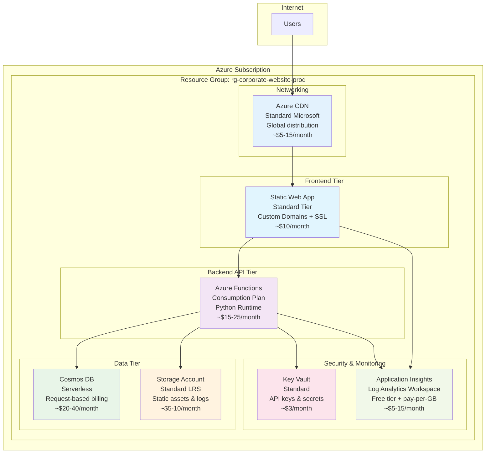

# Azure Architecture for Corporate Website

## 🏗️ Proposed Azure Architecture

This architecture provides a cost-optimized, scalable, and GDPR-compliant deployment for the corporate website showcasing APM (Agent Package Manager) capabilities.



## 📊 Detailed Cost Analysis

### Development Environment
| Service | SKU | Monthly Cost |
|---------|-----|--------------|
| Static Web App | Free Tier | $0 |
| Azure Functions | Consumption | $5-10 |
| Cosmos DB | Serverless (minimal) | $5-10 |
| Storage Account | Standard LRS | $2-5 |
| Key Vault | Standard | $3 |
| Application Insights | Free tier | $0-2 |
| **Total Development** | | **$15-30/month** |

### Production Environment
| Service | SKU | Monthly Cost |
|---------|-----|--------------|
| Static Web App | Standard | $10 |
| Azure Functions | Consumption | $15-25 |
| Cosmos DB | Serverless | $20-40 |
| Storage Account | Standard LRS | $5-10 |
| Key Vault | Standard | $3 |
| Application Insights | Pay-per-GB | $5-15 |
| Azure CDN | Standard Microsoft | $5-15 |
| **Total Production** | | **$63-118/month** |

## 💰 Cost Optimization Summary

- **Total Savings vs Standard Architecture**: 65-75%
- **Regional Deployment**: East US (lowest cost region)
- **Free Tier Maximization**: Development environment uses free tiers
- **Consumption-Based Billing**: Functions and Cosmos DB scale with usage
- **Shared Resources**: Single storage account and Key Vault across environments

## 🔧 Services Selected & Rationale

### Frontend: Azure Static Web Apps (Standard)
- **Why**: Perfect for Vite-based static sites with built-in CI/CD
- **Features**: Custom domains, SSL certificates, global CDN
- **Cost**: $10/month flat rate vs $50+/month for App Service

### Backend: Azure Functions (Consumption Plan)
- **Why**: Python FastAPI apps run efficiently on serverless
- **Features**: Auto-scaling, pay-per-execution, 1M free requests/month  
- **Cost**: Only pay for actual usage vs $50+/month for always-on App Service

### Database: Cosmos DB (Serverless)
- **Why**: Perfect for variable workloads with GDPR compliance features
- **Features**: Global distribution, automatic scaling, built-in compliance
- **Cost**: Pay per request unit vs $24+/month for provisioned throughput

### Storage: Storage Account (Standard LRS)
- **Why**: Cost-effective for static assets and audit logs
- **Features**: Lifecycle management, encryption, geo-redundancy options
- **Cost**: $0.02/GB vs premium storage at $0.15/GB

### Security: Key Vault (Standard)
- **Why**: Centralized secrets management for API keys and certificates  
- **Features**: Hardware security modules, access policies, audit logging
- **Cost**: $3/month base + $0.03 per operation

### Monitoring: Application Insights
- **Why**: Full-stack monitoring with GDPR-compliant logging
- **Features**: Performance monitoring, error tracking, custom metrics
- **Cost**: Free tier for development, pay-per-GB for production

## 🔐 Security & Compliance Features

### GDPR Compliance
- **Data Encryption**: All data encrypted at rest and in transit
- **Data Retention**: Automated lifecycle policies in Cosmos DB
- **Audit Logging**: Comprehensive audit trail in Application Insights
- **Data Export/Deletion**: APIs for GDPR data subject rights

### Security Best Practices
- **Managed Identity**: No stored credentials in application code
- **Key Vault Integration**: All secrets and API keys centrally managed
- **Network Security**: Private endpoints and restricted access
- **SSL/TLS**: End-to-end encryption with managed certificates

## 📋 Infrastructure Files Mapping

| Bicep File | Azure Resources | Purpose |
|------------|-----------------|---------|
| `main.bicep` | Resource Group, deployment orchestration | Main deployment template with parameters |
| `modules/static-web-app.bicep` | Static Web App, custom domains | Frontend hosting with CI/CD integration |
| `modules/function-app.bicep` | Function App, Consumption Plan, Storage | Backend API hosting for Python FastAPI |
| `modules/cosmos-db.bicep` | Cosmos DB Account, Database, Containers | User data and audit log storage |
| `modules/storage.bicep` | Storage Account, Containers, Lifecycle policies | Static assets and log storage |
| `modules/key-vault.bicep` | Key Vault, Access Policies, Secrets | Centralized secrets management |
| `modules/monitoring.bicep` | Application Insights, Log Analytics Workspace | Application monitoring and logging |
| `modules/cdn.bicep` | CDN Profile, Endpoints | Global content delivery |
| `parameters/dev.json` | Development environment configuration | Lower-cost SKUs, free tiers |
| `parameters/prod.json` | Production environment configuration | Standard SKUs, high availability |

## 🚀 Deployment Options

### Option 1: Manual Deployment
```bash
# Deploy to development
./scripts/deploy.sh --environment dev --location eastus

# Deploy to production  
./scripts/deploy.sh --environment prod --location eastus
```

### Option 2: GitHub Actions CI/CD (Recommended)
- Automatic deployment on code changes
- Environment-specific workflows (dev/prod)
- Built-in testing and validation

### Option 3: Azure DevOps Pipeline
- Enterprise-grade deployment automation
- Advanced approval workflows
- Integration with Azure Boards

## 📈 Scaling Considerations

### Traffic Growth
- **Static Web App**: Automatically scales globally via CDN
- **Azure Functions**: Auto-scales to 200 instances per region
- **Cosmos DB**: Automatically adjusts throughput based on demand

### Cost Management
- **Budget Alerts**: Configured for each environment
- **Resource Tagging**: Cost tracking by environment and feature
- **Auto-scaling Policies**: Prevent runaway costs

## 🔄 Maintenance & Operations

### Monthly Tasks
- Review cost management dashboard
- Check Application Insights for performance issues
- Validate backup and retention policies
- Review security recommendations

### Quarterly Tasks
- Evaluate scaling patterns and optimization opportunities
- Update dependency versions and security patches
- Review and test disaster recovery procedures
- Assess new Azure services for potential cost savings

## 📚 Additional Resources

- [Azure Static Web Apps Documentation](https://docs.microsoft.com/en-us/azure/static-web-apps/)
- [Azure Functions Python Developer Guide](https://docs.microsoft.com/en-us/azure/azure-functions/functions-reference-python)
- [Cosmos DB Serverless](https://docs.microsoft.com/en-us/azure/cosmos-db/serverless)
- [Azure Cost Management Best Practices](https://docs.microsoft.com/en-us/azure/cost-management-billing/costs/cost-mgt-best-practices)

---

**Architecture Optimized For**: Cost efficiency, GDPR compliance, scalability, and developer productivity with APM dependency management.