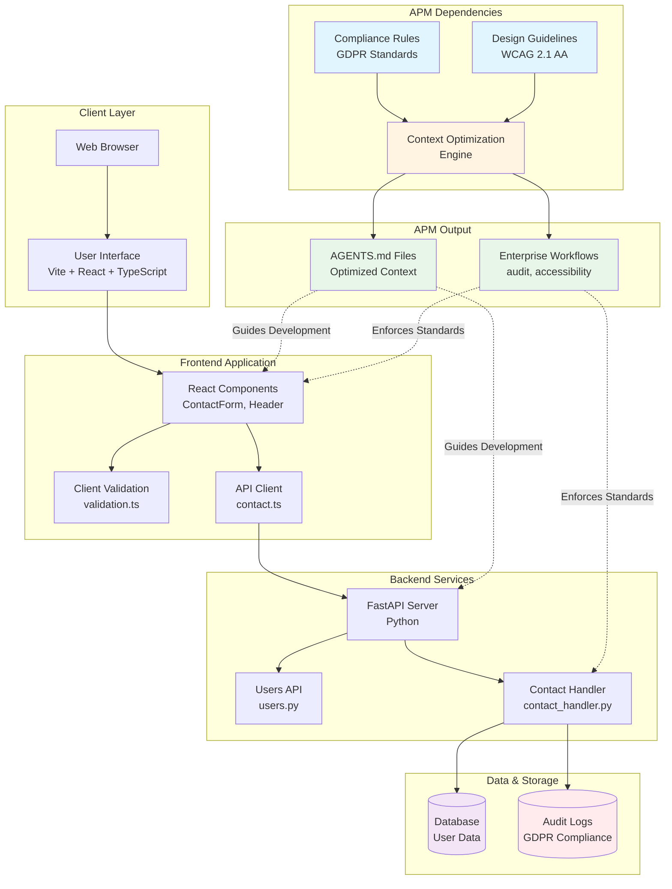
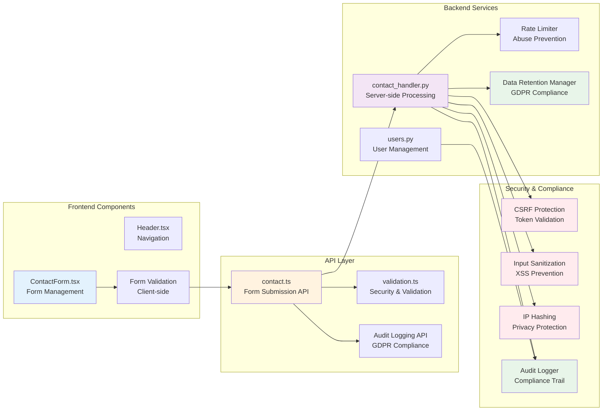
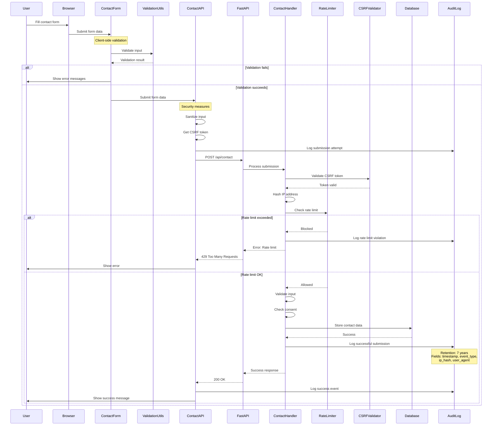
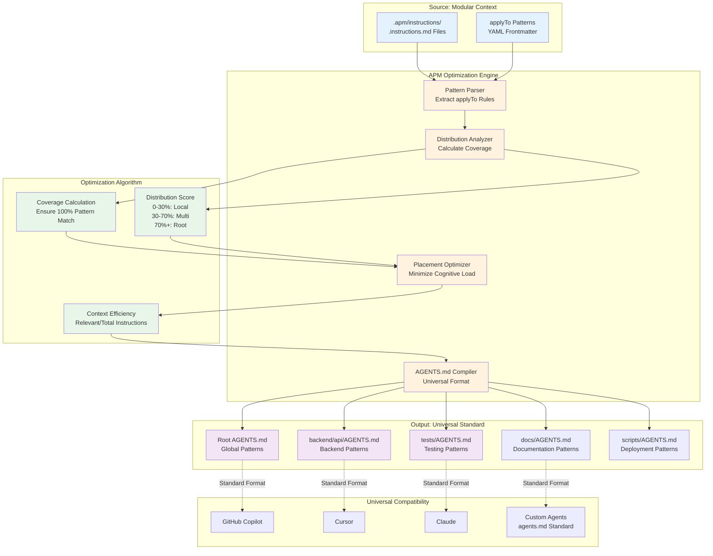
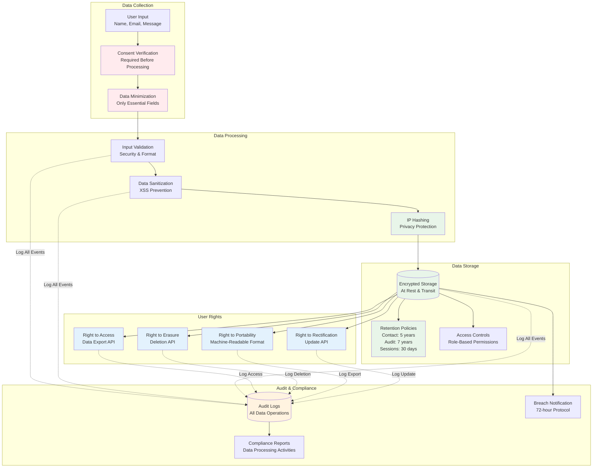
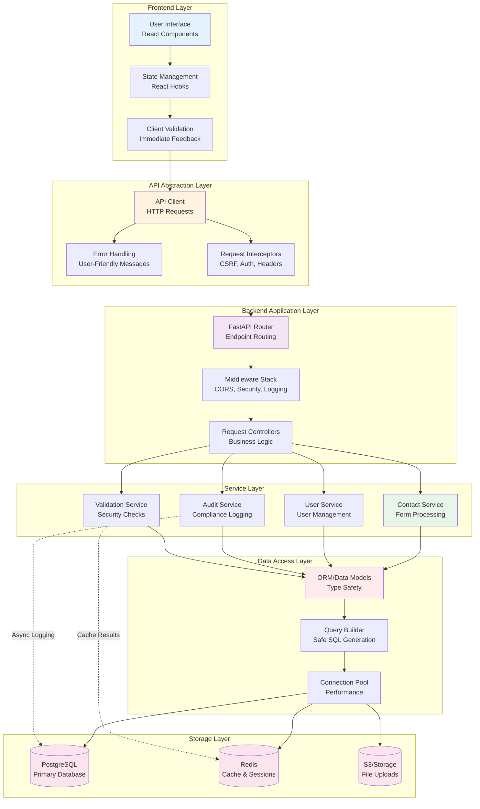
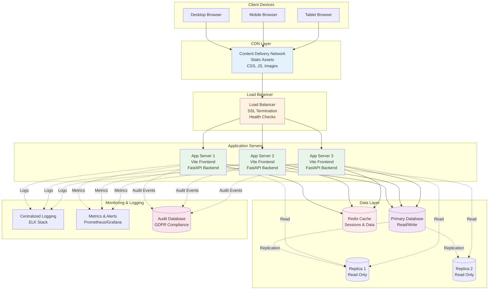

# Corporate Website Architecture

> **Enterprise-grade web architecture with automatic compliance and design enforcement through APM dependency composition**

This document provides a comprehensive overview of the corporate website's system architecture, demonstrating APM (AI-Native Package Manager) capabilities for enterprise development with built-in GDPR compliance and WCAG 2.1 AA accessibility.

## Table of Contents

- [High-Level System Overview](#high-level-system-overview)
- [Component Architecture](#component-architecture)
- [Data Flow Architecture](#data-flow-architecture)
- [APM Context Optimization Engine](#apm-context-optimization-engine)
- [GDPR Compliance Architecture](#gdpr-compliance-architecture)
- [Module Interaction Patterns](#module-interaction-patterns)
- [Technology Stack](#technology-stack)

## High-Level System Overview

The corporate website is built on a modern, separation-of-concerns architecture that integrates compliance and design standards through APM dependencies.



### Key Architectural Principles

1. **Separation of Concerns**: Clear boundaries between frontend, backend, and data layers
2. **Compliance by Design**: GDPR requirements integrated at architectural level through APM dependencies
3. **Accessibility First**: WCAG 2.1 AA standards enforced via design guidelines dependency
4. **Context Optimization**: APM engine minimizes cognitive load while ensuring full coverage
5. **Universal Compatibility**: Standard AGENTS.md output works with all major coding agents

## Component Architecture

The application follows a modular component architecture with clear responsibilities and interaction patterns.



### Component Responsibilities

#### Frontend Components

- **ContactForm.tsx**: React component with accessibility features (ARIA labels, keyboard navigation)
- **Header.tsx**: Navigation component following design system standards
- **Form Validation**: Client-side validation for immediate user feedback

#### API Layer

- **contact.ts**: Handles form submission with GDPR compliance measures
- **validation.ts**: Security utilities (input sanitization, email validation, rate limiting)
- **Audit API**: Logs user interactions for compliance trail

#### Backend Services

- **contact_handler.py**: Server-side contact form processing with full compliance
- **users.py**: FastAPI user management endpoints
- **Rate Limiter**: Prevents abuse (5 requests per 5 minutes)
- **Data Retention Manager**: Implements GDPR retention policies

## Data Flow Architecture

This diagram shows the complete flow for a contact form submission, demonstrating validation, security, and audit logging at each stage.



### Data Flow Security Layers

1. **Client-Side Validation**: Immediate feedback, prevents obviously invalid data
2. **CSRF Protection**: Token-based validation prevents cross-site attacks
3. **Input Sanitization**: Removes potentially malicious content (XSS prevention)
4. **Rate Limiting**: Prevents abuse and DoS attacks
5. **IP Hashing**: Protects user privacy while maintaining audit trail
6. **Audit Logging**: Complete compliance trail for GDPR requirements

## APM Context Optimization Engine

The APM Context Optimization Engine is the core innovation that enables intelligent context distribution to AI coding agents while maintaining universal compatibility.



### Context Optimization Algorithm

The APM engine uses mathematical optimization to determine optimal placement of context instructions:

#### Distribution Score Calculation
```
distribution_score = matching_patterns / total_patterns

Where:
- matching_patterns: Number of file types that match the applyTo pattern
- total_patterns: Total number of file types in the project
```

#### Placement Strategy
- **0-30% distribution**: Place locally (e.g., `backend/**/*.py` → `backend/api/AGENTS.md`)
- **30-70% distribution**: Smart multi-placement with coverage verification
- **70%+ distribution**: Place at root (e.g., `**/*.{js,ts,tsx}` → root `AGENTS.md`)

#### Optimization Goals
1. **Full Coverage**: Every pattern matches files that can access appropriate AGENTS.md
2. **Minimal Pollution**: Each AGENTS.md contains only relevant instructions
3. **Maximum Efficiency**: `Context_Efficiency = Relevant_Instructions / Total_Instructions`
4. **Universal Output**: Standard AGENTS.md format for all coding agents

### Real Example from This Project

```yaml
# Source: .apm/instructions/backend.instructions.md
---
applyTo: "backend/**/*.py"
---
# Backend development guidelines...
```

**APM Optimization Result:**
- Distribution Score: 5.6% (backend-only)
- Strategy: Single Point Placement
- Output: `backend/api/AGENTS.md`
- Coverage: ✅ Perfect (100% backend files covered)
- Efficiency: 100% (zero frontend pollution)

**Project-Wide Metrics:**
- Context Efficiency: 49.6%
- AGENTS.md Files Created: 5 (root, backend/api, tests, docs, scripts)
- Universal Compatibility: ✅ All major coding agents

## GDPR Compliance Architecture

GDPR compliance is enforced through architectural patterns, not just code-level checks. This ensures privacy protection at every layer.



### GDPR Compliance Implementation

#### 1. Data Minimization
- Only collect essential fields: name, email, message
- No tracking cookies or unnecessary analytics
- Clear purpose statement for each data point

#### 2. Consent Management
- Explicit consent required before form submission
- Clear privacy policy linked at submission
- Opt-in only (no pre-checked boxes)

#### 3. Data Protection
```python
# IP Address Hashing (privacy protection)
def hash_ip_address(ip_address: str) -> str:
    salt = "corporate_website_salt_2025"
    salted_ip = f"{ip_address}{salt}"
    return hashlib.sha256(salted_ip.encode()).hexdigest()
```

#### 4. Audit Trail
All data operations are logged:
- Form submission attempts
- Validation errors
- Successful submissions
- Data export requests
- Data deletion requests

#### 5. Retention Policies
```python
RETENTION_POLICIES = {
    'contact_forms': timedelta(days=5*365),  # 5 years
    'audit_logs': timedelta(days=7*365),     # 7 years
    'user_sessions': timedelta(days=30),     # 30 days
}
```

#### 6. User Rights Implementation
- **Right to Access**: `GET /api/users/{userId}/export`
- **Right to Erasure**: `DELETE /api/users/{userId}`
- **Right to Portability**: JSON/CSV export format
- **Right to Rectification**: `PATCH /api/users/{userId}`

## Module Interaction Patterns

The system follows clear interaction patterns between frontend, backend, and storage layers.



### Interaction Flow Patterns

#### 1. Request Flow (Frontend → Backend)
```
User Action → React Component → API Client → FastAPI Router → 
Service Layer → Data Access → Database
```

#### 2. Response Flow (Backend → Frontend)
```
Database → Data Access → Service Layer → Controller → 
FastAPI Response → API Client → React Component → UI Update
```

#### 3. Error Handling Flow
```
Error → Service Layer → Controller → Error Handler → 
API Client → User-Friendly Message → UI Display
```

#### 4. Audit Logging Flow (Asynchronous)
```
Any Data Operation → Audit Service → Async Queue → 
Audit Log Database → Compliance Reports
```

## Technology Stack

### Frontend
- **Build Tool**: Vite 7.1.5 (fast, modern development)
- **Language**: TypeScript (type safety)
- **Framework**: React (component-based UI)
- **Styling**: SCSS (maintainable styles)
- **Accessibility**: WCAG 2.1 AA compliance (enforced by design-guidelines dependency)

### Backend
- **Framework**: FastAPI (Python, high performance)
- **Language**: Python 3.x (type hints, async support)
- **API Style**: RESTful HTTP/JSON
- **Validation**: Pydantic models (automatic validation)

### Security
- **CSRF Protection**: Token-based validation
- **Input Sanitization**: XSS prevention
- **Rate Limiting**: Abuse prevention (5 req/5 min)
- **IP Hashing**: Privacy protection (SHA-256)
- **HTTPS**: TLS encryption in transit

### Compliance
- **GDPR**: Built-in compliance (danielmeppiel/compliance-rules dependency)
- **Audit Logging**: Complete operation trail
- **Data Retention**: Automated policy enforcement
- **User Rights**: Export, deletion, portability APIs

### Development Tools
- **APM CLI**: Dependency management and context optimization
- **APM Dependencies**:
  - `danielmeppiel/compliance-rules`: GDPR standards
  - `danielmeppiel/design-guidelines`: WCAG 2.1 AA accessibility
- **Code Quality**: Accessibility testing (axe-core, pa11y, lighthouse)

### Deployment
- **Build**: `npm run build` (Vite production build)
- **Server**: `npm run dev` (development), `npm run preview` (production preview)
- **Workflows**: APM enterprise workflows (audit, accessibility, design review)

## Architecture Decision Records

### Why APM for Context Management?

**Problem**: AI coding agents need relevant context without cognitive overload. Traditional approaches either overwhelm agents with all instructions or miss critical guidelines.

**Solution**: APM's Context Optimization Engine mathematically determines optimal placement of context instructions:
- **Modular Source**: `.instructions.md` files with `applyTo` patterns
- **Smart Compilation**: Algorithms analyze distribution and place optimally
- **Universal Output**: Standard `AGENTS.md` files work with all major agents

**Result**: 49.6% context efficiency with 100% coverage guarantee.

### Why FastAPI for Backend?

**Reasons**:
1. **Performance**: Async support for high concurrency
2. **Type Safety**: Automatic validation with Pydantic
3. **API Documentation**: Auto-generated OpenAPI/Swagger
4. **Modern Python**: Type hints, async/await patterns

### Why Vite for Frontend?

**Reasons**:
1. **Speed**: Near-instant HMR (Hot Module Replacement)
2. **Modern**: ES modules, tree-shaking, code splitting
3. **TypeScript**: First-class TypeScript support
4. **Simplicity**: Minimal configuration required

### Why GDPR Compliance at Architecture Level?

**Approach**: Compliance enforced through architectural patterns, not just code checks.

**Benefits**:
1. **Impossible to Bypass**: Built into system structure
2. **Audit Trail**: Automatic logging at every layer
3. **User Rights**: API-first implementation (export, delete, portability)
4. **Data Minimization**: Only essential fields collected
5. **Retention Policies**: Automated enforcement

## Deployment Architecture



## Performance Considerations

### Frontend Performance
- **Code Splitting**: Dynamic imports for route-based splitting
- **Tree Shaking**: Remove unused code in production builds
- **Asset Optimization**: Minification, compression (gzip/brotli)
- **Lazy Loading**: Load components and images on demand
- **Caching Strategy**: Service workers, cache-first for static assets

### Backend Performance
- **Async Operations**: Non-blocking I/O with async/await
- **Connection Pooling**: Reuse database connections
- **Response Caching**: Redis for frequently accessed data
- **Database Indexing**: Optimized queries with proper indexes
- **Rate Limiting**: Prevent abuse and ensure fair resource distribution

### Monitoring & Observability
- **Metrics**: Request latency, error rates, throughput
- **Logging**: Structured logs with correlation IDs
- **Tracing**: Distributed tracing for request flows
- **Alerting**: Automated alerts for anomalies
- **Health Checks**: Endpoint availability monitoring

## Security Architecture

### Defense in Depth

1. **Network Layer**: HTTPS/TLS, firewall rules, DDoS protection
2. **Application Layer**: CSRF tokens, input validation, output encoding
3. **Data Layer**: Encryption at rest, encrypted connections, access controls
4. **Monitoring Layer**: Intrusion detection, audit logging, anomaly detection

### Security Best Practices

- **Input Validation**: Whitelist-based validation on all user input
- **Output Encoding**: Prevent XSS through proper encoding
- **Authentication**: Secure session management
- **Authorization**: Role-based access control (RBAC)
- **Secrets Management**: Environment variables, no hardcoded secrets
- **Dependency Scanning**: Regular updates and vulnerability checks

## Scalability Patterns

### Horizontal Scaling
- **Stateless Application Servers**: Enable multiple instances
- **Load Balancing**: Distribute traffic across instances
- **Database Replication**: Read replicas for query distribution
- **Cache Layer**: Redis for session and data caching

### Vertical Scaling
- **Resource Allocation**: Optimize CPU, memory, disk I/O
- **Database Optimization**: Query optimization, indexing
- **Code Optimization**: Profiling and performance tuning

## Future Architecture Considerations

### Potential Enhancements
1. **Microservices**: Split into user service, contact service, audit service
2. **Event-Driven**: Message queue (RabbitMQ, Kafka) for async processing
3. **GraphQL API**: Replace REST for more flexible data fetching
4. **Serverless Functions**: AWS Lambda for specific operations
5. **Multi-Region Deployment**: Geographic distribution for lower latency
6. **Advanced Analytics**: Real-time data processing and insights

## References

- **APM CLI Documentation**: [github/apm-cli](https://github.com/github/apm-cli)
- **AGENTS.md Standard**: [joggrdocs/agents.md](https://github.com/joggrdocs/agents.md)
- **Compliance Rules**: [danielmeppiel/compliance-rules](https://github.com/danielmeppiel/compliance-rules)
- **Design Guidelines**: [danielmeppiel/design-guidelines](https://github.com/danielmeppiel/design-guidelines)
- **GDPR Compliance**: [GDPR Official Text](https://gdpr-info.eu/)
- **WCAG 2.1 AA**: [W3C WCAG Guidelines](https://www.w3.org/WAI/WCAG21/quickref/)
- **FastAPI**: [FastAPI Documentation](https://fastapi.tiangolo.com/)
- **Vite**: [Vite Documentation](https://vitejs.dev/)

## Conclusion

The corporate website architecture demonstrates enterprise-grade development with automatic compliance and design enforcement through APM dependencies. Key innovations include:

1. **APM Context Optimization Engine**: Mathematical algorithms ensure optimal context distribution with 49.6% efficiency
2. **GDPR Compliance by Design**: Architectural patterns enforce privacy protection at every layer
3. **WCAG 2.1 AA Accessibility**: Design guidelines dependency ensures accessible UI components
4. **Universal Agent Compatibility**: Standard AGENTS.md output works with all major coding agents
5. **Modular Architecture**: Clear separation of concerns enables maintainability and scalability

This architecture serves as a reference implementation for enterprise projects requiring compliance, accessibility, and AI-native development workflows.
