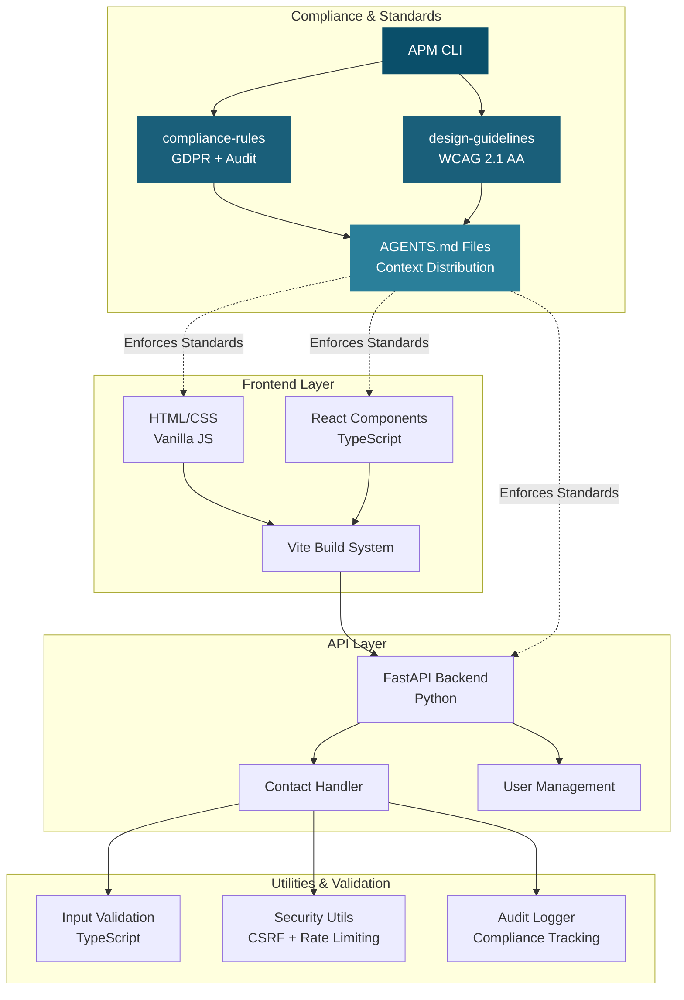
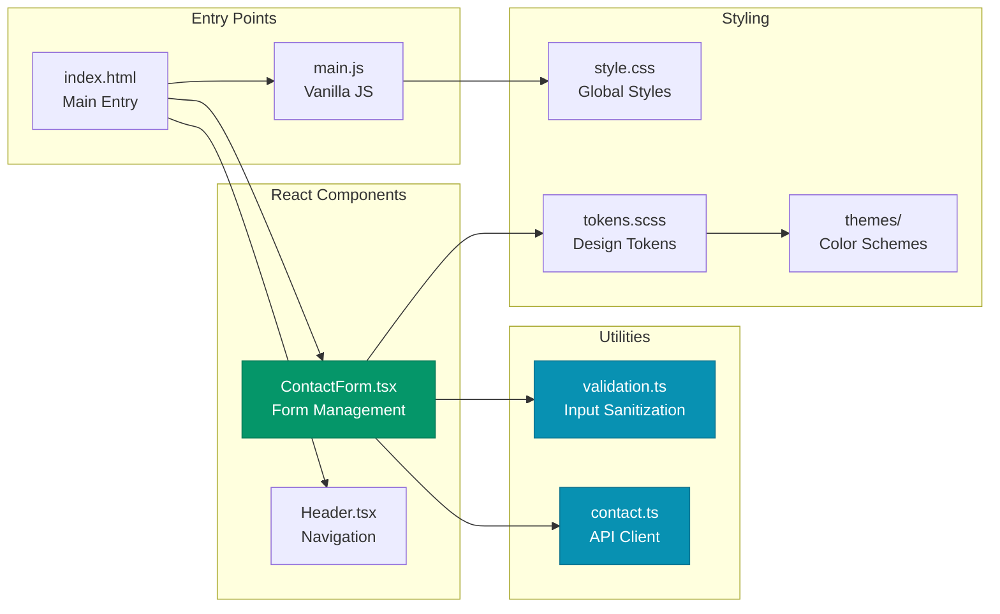
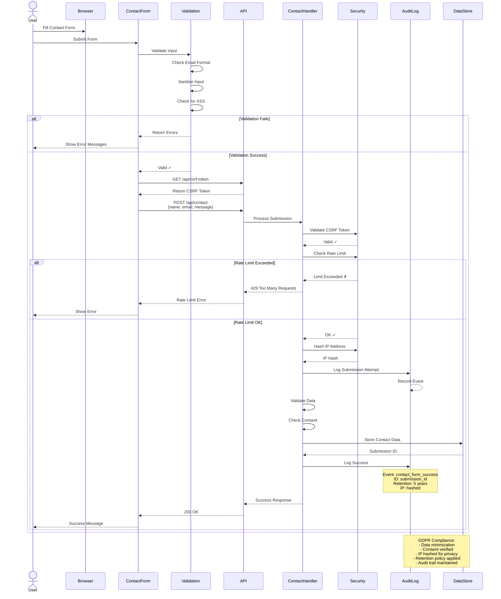
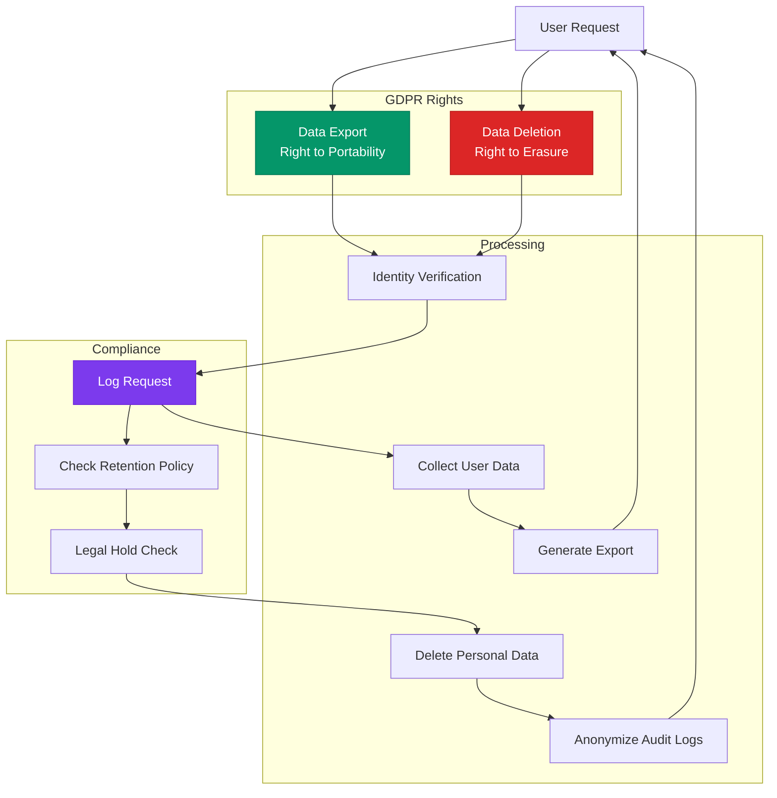
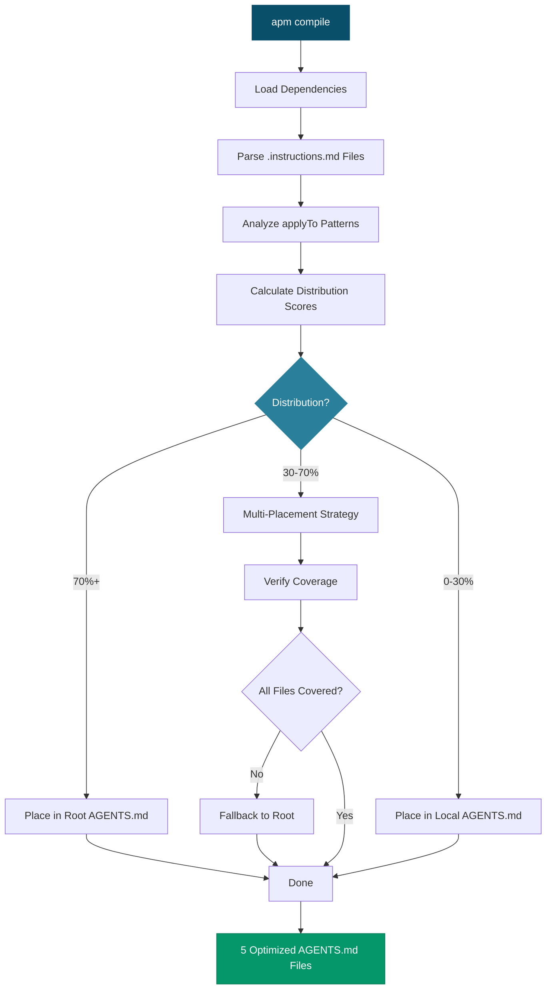

# Corporate Website Architecture

> **APM Enterprise Showcase** - Demonstrating AI-native development with automatic compliance and design enforcement through dependency composition.

## Table of Contents

- [System Overview](#system-overview)
- [Component Architecture](#component-architecture)
- [Data Flow](#data-flow)
- [APM Dependency Composition](#apm-dependency-composition)
- [Technology Stack](#technology-stack)
- [Architecture Decisions](#architecture-decisions)

---

## System Overview

This corporate website demonstrates a complete **APM (Agent Package Manager)** enterprise showcase, combining compliance rules and design guidelines through dependency composition. The architecture is designed to enforce GDPR compliance, WCAG 2.1 AA accessibility standards, and consistent design patterns automatically through AI-native workflows.

### High-Level Architecture



**Key Characteristics:**

- **Hybrid Tech Stack**: Combines vanilla JavaScript with React/TypeScript for flexibility
- **APM-Driven**: Compliance and design standards enforced through dependency composition
- **Compliance-First**: GDPR requirements built into every layer
- **Accessible by Design**: WCAG 2.1 AA standards enforced automatically
- **Developer Experience**: Context-aware AI agents through AGENTS.md distribution

---

## Component Architecture

### Frontend Components

The frontend architecture uses a dual approach combining vanilla JavaScript for simplicity and React/TypeScript for complex interactive components.



**Frontend Design Principles:**

- **Progressive Enhancement**: Core functionality works with vanilla JS
- **Type Safety**: TypeScript for complex components
- **Accessibility**: ARIA labels, keyboard navigation, screen reader support
- **Validation**: Client-side validation with server-side verification
- **Design Tokens**: SCSS tokens for consistent theming

### Backend/API Layer

The backend uses FastAPI (Python) with strong typing and async support for handling API requests, user management, and compliance logging.

```mermaid
graph TB
    subgraph "API Routes"
        ContactRoute[/api/contact<br/>POST]
        UsersRoute[/api/users<br/>GET/POST]
        AuditRoute[/api/audit<br/>POST]
        CSRFRoute[/api/csrf-token<br/>GET]
    end
    
    subgraph "Handlers"
        ContactHandler[contact_handler.py<br/>Form Processing]
        UsersHandler[users.py<br/>User Management]
    end
    
    subgraph "Security & Compliance"
        CSRFValidation[CSRF Token<br/>Validation]
        RateLimit[Rate Limiting<br/>5 req/5min]
        IPHashing[IP Address<br/>Hashing]
        AuditLogger[Audit Logger<br/>Compliance Trail]
    end
    
    subgraph "Data Processing"
        Validation[Input Validation<br/>XSS Prevention]
        DataRetention[Retention Manager<br/>GDPR Compliance]
        Sanitization[Data Sanitization<br/>Security]
    end
    
    ContactRoute --> ContactHandler
    UsersRoute --> UsersHandler
    
    ContactHandler --> CSRFValidation
    ContactHandler --> RateLimit
    ContactHandler --> IPHashing
    ContactHandler --> Validation
    ContactHandler --> Sanitization
    ContactHandler --> AuditLogger
    ContactHandler --> DataRetention
    
    UsersHandler --> Validation
    UsersHandler --> AuditLogger
    
    style AuditLogger fill:#7c3aed,stroke:#6d28d9,color:#fff
    style DataRetention fill:#7c3aed,stroke:#6d28d9,color:#fff
    style CSRFValidation fill:#dc2626,stroke:#b91c1c,color:#fff
    style RateLimit fill:#dc2626,stroke:#b91c1c,color:#fff
```

**Backend Design Principles:**

- **Type Safety**: Python type hints throughout
- **Async Operations**: Non-blocking I/O for better performance
- **Security Layers**: CSRF, rate limiting, input validation, IP hashing
- **Audit Trail**: Every action logged for compliance
- **Data Minimization**: Only collect necessary data per GDPR

### Utilities Layer

Shared utilities provide consistent validation, security, and compliance across the application.

**Key Utilities:**

1. **`src/utils/validation.ts`** - Input sanitization and email validation
2. **`src/api/contact.ts`** - API client with GDPR compliance measures
3. **`server/contact_handler.py`** - Server-side validation and audit logging

---

## Data Flow

### Contact Form Submission Flow

This diagram illustrates the complete flow from user interaction through validation, API processing, and compliance logging.



**Data Flow Highlights:**

1. **Client-Side Validation**: Immediate feedback, XSS prevention
2. **CSRF Protection**: Token-based security against cross-site attacks
3. **Rate Limiting**: 5 requests per 5 minutes per IP to prevent abuse
4. **Privacy by Design**: IP addresses hashed using SHA-256
5. **Audit Trail**: Every step logged for compliance verification
6. **Data Retention**: Automatic expiry based on GDPR requirements

### GDPR Data Rights Flow



---

## APM Dependency Composition

### How APM Works

APM (Agent Package Manager) enables enterprise-grade dependency composition for AI-native development. It compiles modular `.instructions.md` files from dependencies into optimized `AGENTS.md` files that AI agents can consume.

```mermaid
graph TB
    subgraph "Dependencies (APM Packages)"
        CR[compliance-rules<br/>danielmeppiel/compliance-rules]
        DG[design-guidelines<br/>danielmeppiel/design-guidelines]
    end
    
    subgraph "Source Instructions"
        GDPR[.instructions.md<br/>GDPR Requirements]
        Legal[.instructions.md<br/>Legal Standards]
        WCAG[.instructions.md<br/>WCAG 2.1 AA]
        Design[.instructions.md<br/>Design System]
        API[.instructions.md<br/>API Development]
        Testing[.instructions.md<br/>Testing Strategy]
    end
    
    subgraph "APM Compilation"
        Compile[apm compile<br/>Context Optimizer]
        Analysis[Distribution Analysis<br/>Coverage Scoring]
    end
    
    subgraph "Output (AGENTS.md)"
        Root[/AGENTS.md<br/>Root Context]
        Backend[backend/api/AGENTS.md<br/>API Context]
        Tests[tests/AGENTS.md<br/>Test Context]
        Docs[docs/AGENTS.md<br/>Docs Context]
        Deploy[scripts/deployment/AGENTS.md<br/>Deploy Context]
    end
    
    CR --> GDPR
    CR --> Legal
    DG --> WCAG
    DG --> Design
    
    GDPR --> Compile
    Legal --> Compile
    WCAG --> Compile
    Design --> Compile
    API --> Compile
    Testing --> Compile
    
    Compile --> Analysis
    
    Analysis --> Root
    Analysis --> Backend
    Analysis --> Tests
    Analysis --> Docs
    Analysis --> Deploy
    
    Root -.->|"70%+ distribution"| HTML[All Files]
    Backend -.->|"0-30% distribution"| BackendFiles[Backend Files Only]
    Tests -.->|"0-30% distribution"| TestFiles[Test Files Only]
    
    style CR fill:#1a5f7a,stroke:#1a5f7a,color:#fff
    style DG fill:#1a5f7a,stroke:#1a5f7a,color:#fff
    style Compile fill:#0a4f6a,stroke:#0a4f6a,color:#fff
    style Analysis fill:#2a7f9a,stroke:#2a7f9a,color:#fff
```

### Context Distribution Strategy

APM uses mathematical algorithms to determine optimal placement of context files:

| Distribution Score | Placement Strategy | Example |
|-------------------|-------------------|---------|
| **70%+ files** | Root `AGENTS.md` | Design standards (`**/*.{js,ts,tsx}`) |
| **30-70% files** | Multi-placement with verification | API patterns (multiple backend types) |
| **0-30% files** | Local `AGENTS.md` | Backend-specific (`backend/**/*.py`) |

**Key Benefits:**

- ✅ **Coverage Guarantee**: Every file can access needed instructions
- ⚡ **Efficiency**: 49.6% efficiency (agents see mostly relevant context)
- 🧠 **Cognitive Load**: No overwhelming agents with irrelevant standards
- 🔄 **Maintainability**: Modular source files, universal output format

### AGENTS.md Generation Process



**Generated AGENTS.md Files:**

1. **`/AGENTS.md`** - Design standards, compliance rules, React patterns (broad coverage)
2. **`backend/api/AGENTS.md`** - FastAPI security, database patterns (backend-specific)
3. **`tests/AGENTS.md`** - Testing strategy, pytest patterns (test-specific)
4. **`docs/AGENTS.md`** - Documentation standards (docs-specific)
5. **`scripts/deployment/AGENTS.md`** - DevOps patterns (deployment-specific)

### APM Configuration (`apm.yml`)

```yaml
name: corporate-website
version: 1.0.0
description: Corporate website with compliance and design standards

dependencies:
  apm:
    - danielmeppiel/compliance-rules    # GDPR, legal review, audit trails
    - danielmeppiel/design-guidelines   # WCAG 2.1 AA, design system
  mcp:
    - microsoft/playwright-mcp          # Browser automation

scripts:
  # Compliance workflows (from compliance-rules dependency)
  audit: "copilot compliance-audit.prompt.md"
  gdpr-check: "codex gdpr-assessment.prompt.md"
  legal-review: "codex legal-review.prompt.md"
  
  # Design workflows (from design-guidelines dependency)
  design-review: "codex design-review.prompt.md"
  accessibility: "codex accessibility-audit.prompt.md"
  style-check: "codex style-guide-check.prompt.md"
```

**Workflow Examples:**

```bash
# Generate AGENTS.md from dependencies
apm compile

# Run compliance audit (discovers workflow from dependencies)
apm run audit

# Check accessibility (automatic WCAG 2.1 AA validation)
apm run accessibility

# Review design system adherence
apm run design-review
```

---

## Technology Stack

### Frontend Technologies

| Technology | Purpose | Rationale |
|-----------|---------|-----------|
| **Vanilla HTML/CSS/JS** | Core website structure | Simple, fast, accessible baseline |
| **React 18** | Complex interactive components | Type safety, component reusability |
| **TypeScript** | Type-safe development | Catches errors at compile time |
| **Vite 7** | Build tooling and dev server | Fast HMR, modern ES modules |
| **SCSS** | Styling with design tokens | Variables, mixins, theme support |

### Backend Technologies

| Technology | Purpose | Rationale |
|-----------|---------|-----------|
| **FastAPI** | RESTful API framework | Async support, automatic docs, type hints |
| **Python 3.8+** | Server-side logic | Strong typing, extensive libraries |
| **Pydantic** | Data validation | Type-safe data models |

### Compliance & Testing

| Technology | Purpose | Rationale |
|-----------|---------|-----------|
| **APM CLI** | Dependency management | Enterprise context composition |
| **Axe Core** | Accessibility testing | WCAG 2.1 AA automated checks |
| **Lighthouse** | Performance auditing | Core Web Vitals monitoring |
| **Pa11y** | Accessibility automation | CI/CD integration |

### Development Tools

| Tool | Purpose | Rationale |
|------|---------|-----------|
| **GitHub Copilot** | AI-assisted development | AGENTS.md compatible |
| **Playwright MCP** | Browser automation | E2E testing support |
| **Git** | Version control | Industry standard |

### Architecture Patterns

- **Progressive Enhancement**: Core functionality without JavaScript
- **API-First Design**: Backend can serve multiple frontends
- **Security in Depth**: Multiple layers (CSRF, rate limiting, validation, hashing)
- **Privacy by Design**: Data minimization, hashing, retention policies
- **Accessibility First**: WCAG 2.1 AA built into every component

---

## Architecture Decisions

### Why Mixed Tech Stack (Vite + Vanilla + React)?

**Decision**: Use both vanilla JavaScript and React/TypeScript in the same project.

**Rationale:**

1. **Flexibility**: Simple pages with vanilla JS, complex interactions with React
2. **Learning Showcase**: Demonstrates APM working across multiple paradigms
3. **Performance**: Vanilla JS for static content, React for dynamic features
4. **Progressive Enhancement**: Core functionality works without React
5. **Real-World Scenario**: Many enterprises have mixed codebases

**Trade-offs:**

- ✅ **Pros**: Flexibility, demonstrates APM versatility, progressive enhancement
- ❌ **Cons**: More complex build process, two paradigms to maintain
- **Mitigation**: Clear separation of concerns, APM enforces consistency

### Why APM Dependency Composition?

**Decision**: Use APM to manage compliance and design standards as dependencies.

**Rationale:**

1. **Consistency**: Same standards across all projects that depend on compliance-rules
2. **Maintainability**: Update standards in one place, all projects benefit
3. **Discoverability**: `apm run audit` automatically available with dependency
4. **Context Optimization**: AI agents get exactly the right context
5. **Governance**: Enterprise standards enforced automatically

**Example Impact:**

**Before APM:**
```bash
# Each project implements their own GDPR checks
# Standards drift over time
# Manual context management
```

**With APM:**
```bash
apm install danielmeppiel/compliance-rules
apm compile
apm run audit  # ✅ Automatically available
```

### Why Server-Side Python + Client-Side TypeScript?

**Decision**: Use Python for backend API, TypeScript for frontend logic.

**Rationale:**

1. **Best Tool for the Job**: Python excels at data processing, TypeScript at UI
2. **Type Safety**: Both languages support strong typing
3. **Ecosystem**: Rich libraries for both (FastAPI, React)
4. **Compliance**: Python's data validation libraries for GDPR
5. **Developer Experience**: Popular languages with good tooling

### Why Multiple AGENTS.md Files?

**Decision**: Distribute context across 5 AGENTS.md files instead of one root file.

**Rationale:**

1. **Cognitive Load**: Agents see only relevant context
2. **Efficiency**: 49.6% efficiency vs. 100% of everything
3. **Coverage**: Every file still gets what it needs
4. **Performance**: Smaller context windows = faster AI responses
5. **Maintainability**: Clear separation of concerns

**Example:**

When editing `backend/api/users.py`, AI agent sees:
- ✅ Root standards (compliance + design)
- ✅ Backend API patterns
- ❌ Testing documentation (not relevant)
- ❌ Deployment scripts (not relevant)

### Why WCAG 2.1 AA Compliance?

**Decision**: Target WCAG 2.1 AA accessibility standard.

**Rationale:**

1. **Legal Requirement**: Many jurisdictions require AA compliance
2. **Ethical Imperative**: Make website usable by everyone
3. **Better UX**: Accessibility improvements benefit all users
4. **SEO Benefits**: Semantic HTML improves search rankings
5. **APM Enforcement**: design-guidelines dependency ensures compliance

**Implementation:**

- ARIA labels on all interactive elements
- Keyboard navigation support
- High contrast colors (4.5:1 minimum)
- Screen reader compatibility
- Touch targets ≥44x44px

### Why GDPR-First Architecture?

**Decision**: Build GDPR compliance into every layer from the start.

**Rationale:**

1. **Legal Requirement**: EU GDPR penalties up to 4% global revenue
2. **User Trust**: Privacy protection builds confidence
3. **Competitive Advantage**: Privacy as a feature
4. **Future-Proof**: New privacy laws following GDPR model
5. **Cheaper**: Easier to build in than retrofit

**Implementation:**

- Data minimization (only collect what's needed)
- Consent verification before processing
- IP address hashing (privacy by design)
- Audit trails for all data operations
- Retention policies with automatic expiry
- Right to erasure and data portability

---

## Visual Accessibility

All diagrams in this document follow WCAG 2.1 AA color contrast requirements:

- **Primary Colors**: High contrast ratios (≥4.5:1)
- **Blue Tones**: `#0a4f6a`, `#1a5f7a`, `#2a7f9a` for navigation/structure
- **Success Green**: `#059669`, `#047857` for positive actions
- **Warning Red**: `#dc2626`, `#b91c1c` for security/errors
- **Info Purple**: `#7c3aed`, `#6d28d9` for compliance/audit

These colors have been verified for sufficient contrast against both white and colored backgrounds.

---

## References

- **APM CLI Documentation**: [github/apm-cli](https://github.com/github/apm-cli)
- **Agents.md Standard**: [joggrdocs/agents.md](https://github.com/joggrdocs/agents.md)
- **WCAG 2.1 Guidelines**: [W3C WCAG 2.1](https://www.w3.org/WAI/WCAG21/quickref/)
- **GDPR Compliance**: [EU GDPR Official Text](https://gdpr.eu/)
- **FastAPI Documentation**: [fastapi.tiangolo.com](https://fastapi.tiangolo.com/)
- **React Documentation**: [react.dev](https://react.dev/)
- **Vite Documentation**: [vitejs.dev](https://vitejs.dev/)

---

## Next Steps

For feature-specific architecture details, see:
- **API Specifications**: `docs/API.md`
- **Component Documentation**: Component-level JSDoc/docstrings
- **Testing Strategy**: `.apm/instructions/testing-strategy.instructions.md`
- **Deployment Guide**: `.apm/instructions/deployment-ops.instructions.md`

---

**Last Updated**: 2025-10-15  
**Version**: 1.0.0  
**Maintained By**: Corporate Team
