# Azure Architecture Documentation

## Executive Summary

This document outlines the cost-optimized Azure deployment architecture for the Corporate Website. The architecture prioritizes minimal costs while meeting all compliance, performance, and scalability requirements.

**Monthly Cost Estimate**: $25-60 USD (Development + Production environments)
**Cost Savings vs Traditional Architecture**: 65-75%

---

## Architecture Diagram

```mermaid
graph TB
    subgraph "Internet"
        Users[👥 Users]
    end
    
    subgraph "Azure Subscription"
        subgraph "Resource Group: rg-corporate-website"
            
            subgraph "Frontend Tier - Static Hosting"
                SWA[Azure Static Web Apps<br/>Standard Tier<br/>$9/month]
            end
            
            subgraph "Backend API Tier"
                FUNC[Azure Functions<br/>Consumption Plan<br/>Pay-per-execution<br/>~$5-15/month]
            end
            
            subgraph "Data & Storage Tier"
                STORAGE[Storage Account<br/>Standard LRS<br/>Hot tier<br/>~$3-8/month]
                COSMOS[Cosmos DB<br/>Serverless Mode<br/>~$5-20/month]
            end
            
            subgraph "Security & Monitoring"
                KV[Key Vault<br/>Standard<br/>~$0.30/month]
                APPINS[Application Insights<br/>Free tier: 5GB/month<br/>$0-2/month]
            end
            
            subgraph "CDN - Optional"
                CDN[Azure CDN<br/>Standard Microsoft<br/>~$5-10/month<br/>Only for global reach]
            end
        end
    end
    
    Users -->|HTTPS| SWA
    SWA -->|API Calls| FUNC
    FUNC -->|Contact Forms| COSMOS
    FUNC -->|Audit Logs| STORAGE
    FUNC -->|Secrets| KV
    FUNC -->|Telemetry| APPINS
    SWA -->|Telemetry| APPINS
    SWA -.->|Optional| CDN
    
    style SWA fill:#0078D4,color:#fff
    style FUNC fill:#0078D4,color:#fff
    style STORAGE fill:#0078D4,color:#fff
    style COSMOS fill:#0078D4,color:#fff
    style KV fill:#0078D4,color:#fff
    style APPINS fill:#0078D4,color:#fff
```

---

## Cost Analysis

### Development Environment
| Service | SKU/Tier | Monthly Cost |
|---------|----------|--------------|
| Static Web Apps | Free Tier | $0 |
| Azure Functions | Consumption (free 1M executions) | $0-5 |
| Cosmos DB | Serverless (free 1000 RU/s) | $0-5 |
| Storage Account | Standard LRS (minimal data) | $1-3 |
| Key Vault | Standard | $0.30 |
| Application Insights | Free tier (5GB) | $0 |
| **Total Development** | | **$1-13/month** |

### Production Environment
| Service | SKU/Tier | Monthly Cost |
|---------|----------|--------------|
| Static Web Apps | Standard | $9 |
| Azure Functions | Consumption (est. 100K executions) | $5-10 |
| Cosmos DB | Serverless (moderate usage) | $5-15 |
| Storage Account | Standard LRS (audit logs) | $2-5 |
| Key Vault | Standard | $0.30 |
| Application Insights | Pay-as-you-go | $0-2 |
| CDN (Optional) | Standard Microsoft | $5-10 |
| **Total Production** | | **$26-51/month** |
| **Total Production with CDN** | | **$31-61/month** |

### Combined Estimate
- **Development + Production**: $27-64/month
- **With CDN**: $32-74/month

### Cost Optimization Strategies Applied

1. **Consumption-based billing**: Functions and Cosmos DB scale to zero
2. **Free tier maximization**: Dev environment uses free tiers where possible
3. **Regional deployment**: Single region to avoid data transfer costs
4. **Serverless architecture**: No always-on compute costs
5. **Standard storage tier**: LRS (Locally Redundant Storage) for non-critical data

---

## Service Selection Rationale

### Frontend: Azure Static Web Apps (Standard)

**Why Static Web Apps?**
- **Integrated CI/CD**: Automatic deployments from GitHub
- **Free SSL certificates**: Automatic HTTPS with custom domains
- **Global CDN**: Built-in content delivery (no extra CDN needed for production)
- **API integration**: Seamless integration with Azure Functions
- **Authentication**: Built-in auth providers if needed later
- **Cost-effective**: $9/month for production (free for dev)

**Alternative considered**: 
- Storage Static Website ($2-3/month) - Rejected: No built-in CI/CD or API integration
- App Service B1 ($13/month) - Rejected: Over-provisioned for static content

### Backend: Azure Functions (Consumption Plan)

**Why Azure Functions?**
- **True serverless**: Pay only for executions (1M free per month)
- **Auto-scaling**: Handles traffic spikes automatically
- **Python 3.11 support**: Native support for FastAPI applications
- **Integrated logging**: Built-in Application Insights integration
- **GDPR compliance ready**: Runs in EU regions if required

**Alternative considered**:
- App Service B1 ($13/month) - Rejected: Always-on cost for variable traffic
- Container Apps ($15-30/month) - Rejected: Overkill for simple API

### Database: Cosmos DB (Serverless)

**Why Cosmos DB Serverless?**
- **Pay-per-request**: No minimum throughput costs
- **Global distribution ready**: Can expand to multiple regions later
- **SLA guarantees**: 99.99% availability
- **Automatic indexing**: Fast queries without management
- **GDPR compliant**: Data residency controls

**Cost calculation example**:
- 10,000 contact form submissions/month
- 1KB per document
- ~50 RU per write
- Total: 500,000 RU/month = ~$1.25/month

**Alternative considered**:
- Azure SQL Basic ($5/month) - Rejected: Provisioned cost, less flexible schema
- Table Storage ($0.50/month) - Rejected: Limited query capabilities

### Storage: Azure Storage Account (Standard LRS)

**Why Storage Account?**
- **Audit logs**: Append blobs for GDPR audit trail
- **File storage**: Static assets, backups
- **Cost-effective**: $0.02 per GB for hot tier
- **99.9% availability**: Locally redundant storage sufficient

**Usage estimates**:
- Audit logs: ~100MB/month → $0.002/month
- Static assets: ~500MB → $0.01/month
- Backups: ~1GB → $0.02/month

### Security: Azure Key Vault (Standard)

**Why Key Vault?**
- **Secrets management**: API keys, connection strings
- **Compliance requirement**: Centralized secret storage
- **Audit trail**: All secret access logged
- **Integration**: Native integration with Functions and Static Web Apps

**Cost**: $0.03 per 10,000 operations + $0.30/month per secret

### Monitoring: Application Insights (Free Tier)

**Why Application Insights?**
- **5GB free data ingestion**: Sufficient for development and small production
- **Distributed tracing**: Track requests across services
- **Custom metrics**: Monitor GDPR compliance metrics
- **Alerts**: Proactive error detection

---

## Infrastructure as Code Mapping

### Bicep Templates Overview

Each Azure service is defined in a modular Bicep file for maintainability and reusability.

| Bicep File | Azure Resource | Purpose |
|------------|----------------|---------|
| `main.bicep` | Resource Group orchestration | Main deployment entry point |
| `modules/staticWebApp.bicep` | Azure Static Web Apps | Frontend hosting and CDN |
| `modules/functionApp.bicep` | Azure Functions + App Service Plan | Backend API (Python FastAPI) |
| `modules/cosmosDb.bicep` | Cosmos DB Account + Database + Container | Contact forms and user data |
| `modules/storage.bicep` | Storage Account + Containers | Audit logs and file storage |
| `modules/keyVault.bicep` | Key Vault + Secrets | Secrets management |
| `modules/appInsights.bicep` | Application Insights + Log Analytics | Monitoring and diagnostics |
| `parameters/dev.json` | - | Development environment configuration |
| `parameters/prod.json` | - | Production environment configuration |

### Architectural Components Explained

#### 1. Frontend - Azure Static Web Apps (`modules/staticWebApp.bicep`)
- **What it deploys**: Static Web App resource with Standard SKU
- **Configuration**: 
  - Free SSL certificate
  - Custom domain support
  - Automatic GitHub Actions integration
  - Built-in CDN for global delivery
- **Environment variables**: API endpoint URL injected during build
- **Cost optimization**: Free tier for dev, Standard ($9/month) for prod

#### 2. Backend API - Azure Functions (`modules/functionApp.bicep`)
- **What it deploys**: 
  - Function App (Python 3.11)
  - Consumption App Service Plan (serverless)
  - System-assigned managed identity
- **Features**:
  - Auto-scaling based on demand
  - VNET integration ready
  - Application Insights integration
  - Environment variables from Key Vault
- **FastAPI deployment**: Uses Azure Functions Python V2 programming model
- **Cost optimization**: Consumption plan - pay only for executions

#### 3. Database - Cosmos DB (`modules/cosmosDb.bicep`)
- **What it deploys**:
  - Cosmos DB account (serverless capacity mode)
  - Database: `corporate-website-db`
  - Containers: `contact-forms`, `audit-logs`
- **Partition keys**:
  - `contact-forms`: `/id` (uniform distribution)
  - `audit-logs`: `/date` (time-series queries)
- **Consistency**: Session consistency (default, cost-effective)
- **Backup**: Continuous backup enabled (7-day retention)
- **Cost optimization**: Serverless mode - pay per request (RU/s)

#### 4. Storage - Azure Storage (`modules/storage.bicep`)
- **What it deploys**:
  - Storage account (Standard LRS)
  - Blob containers: `audit-logs`, `backups`, `static-assets`
  - File shares: `function-app-content`
- **Features**:
  - Lifecycle management policies (auto-delete old logs)
  - Soft delete enabled (7-day retention)
  - HTTPS-only access
  - Minimum TLS 1.2
- **Cost optimization**: Hot tier for active data, cool tier for backups

#### 5. Security - Key Vault (`modules/keyVault.bicep`)
- **What it deploys**:
  - Key Vault with Standard SKU
  - RBAC-based access control
  - Soft-delete and purge protection
- **Secrets stored**:
  - Cosmos DB connection string
  - Storage account connection string
  - API keys for external services
- **Access**: Function App managed identity granted Secret User role
- **Cost**: $0.03 per 10,000 operations

#### 6. Monitoring - Application Insights (`modules/appInsights.bicep`)
- **What it deploys**:
  - Log Analytics Workspace
  - Application Insights instance
  - Free tier (5GB ingestion/month)
- **Monitored metrics**:
  - Request rates and latency
  - Dependency calls (Cosmos DB, Storage)
  - Custom GDPR compliance metrics
  - Exception tracking
- **Alerts configured**:
  - High error rate (>5% in 5 minutes)
  - Slow response time (>3s average)
  - Failed dependency calls

---

## Security Architecture

### GDPR Compliance Features

1. **Data Encryption**
   - At rest: All Azure services use encryption by default
   - In transit: HTTPS/TLS 1.2+ enforced everywhere

2. **Audit Trail**
   - All API calls logged to Application Insights
   - Contact form submissions logged to Cosmos DB
   - Admin actions logged to Storage append blobs

3. **Data Residency**
   - Recommended region: West Europe or North Europe (GDPR-compliant)
   - Data stays within EU boundaries
   - Backup and replication within same region

4. **Access Control**
   - Managed identities for service-to-service authentication
   - Key Vault for secret management
   - RBAC for human access
   - No shared access keys in code

5. **Data Retention**
   - Contact forms: 5 years (configurable via TTL)
   - Audit logs: 7 years (lifecycle policies)
   - User sessions: 30 days (automatic cleanup)

### Network Security

1. **HTTPS Everywhere**: All endpoints use SSL/TLS
2. **CORS Configuration**: Restricted to specific origins
3. **Rate Limiting**: Azure Functions built-in throttling
4. **DDoS Protection**: Azure platform-level protection

---

## Deployment Strategy

### Regional Recommendations

**Primary Region**: West Europe (Amsterdam)
- **Pros**: GDPR-compliant, low latency for EU users, full service availability
- **Cons**: Slightly higher cost than US regions
- **Monthly cost difference**: ~5% more than East US

**Alternative Region**: North Europe (Dublin)
- **Pros**: GDPR-compliant, competitive pricing
- **Cons**: Some services may have limited availability

**Cost comparison** (Production environment):
- West Europe: $28-55/month
- North Europe: $27-53/month
- East US: $26-51/month (not GDPR-optimal)

### Environment Strategy

#### Development Environment
- **Purpose**: Testing and staging
- **Cost target**: <$15/month
- **Characteristics**:
  - Free/consumption tiers only
  - Shared with staging
  - Automatic shutdown policies
  - Minimal data retention

#### Production Environment
- **Purpose**: Live customer-facing site
- **Cost target**: $30-60/month
- **Characteristics**:
  - Standard tiers for SLAs
  - Backup and disaster recovery
  - Full monitoring and alerting
  - Data retention policies enforced

### CI/CD Integration

**GitHub Actions** (Recommended):
- Static Web Apps: Automatic deployment on commit to `main`
- Azure Functions: Deploy via GitHub Actions workflow
- Infrastructure: Deploy Bicep templates via GitHub Actions
- Secrets: Stored in GitHub Secrets, injected at deploy time

**Deployment Flow**:
1. Code pushed to GitHub (`main` branch)
2. GitHub Actions triggered
3. Build frontend (Vite)
4. Deploy to Static Web Apps (automatic)
5. Build Python Functions
6. Deploy to Azure Functions
7. Run smoke tests
8. Notify on success/failure

---

## Monitoring and Alerting

### Key Metrics

1. **Availability**: >99.5% uptime
2. **Response Time**: <500ms average (P95)
3. **Error Rate**: <1% of requests
4. **Cost**: Alert if monthly cost exceeds budget by 20%

### Application Insights Dashboards

1. **User Experience**
   - Page load times
   - API response times
   - Error rates by endpoint

2. **GDPR Compliance**
   - Contact form submissions
   - Data export requests
   - Data deletion requests
   - Audit log entries

3. **Cost Optimization**
   - Function execution count
   - Cosmos DB RU consumption
   - Storage usage trends

### Alert Configuration

| Alert | Condition | Action |
|-------|-----------|--------|
| High Error Rate | >5% errors in 5 min | Email + SMS |
| Slow Response | >3s average for 10 min | Email |
| Cost Overrun | >120% of monthly budget | Email |
| Failed Deployments | Any deployment failure | Email + Slack |

---

## Disaster Recovery

### Backup Strategy

1. **Cosmos DB**: Continuous backup (7-day retention)
2. **Storage Account**: Geo-redundant backups weekly
3. **Configuration**: All infrastructure in Bicep (version controlled)
4. **Secrets**: Key Vault soft-delete (90-day recovery window)

### Recovery Time Objectives

- **RTO** (Recovery Time Objective): 4 hours
- **RPO** (Recovery Point Objective): 1 hour

### Recovery Procedures

1. **Complete Region Failure**:
   - Deploy Bicep templates to alternate region
   - Restore Cosmos DB from backup
   - Update DNS to point to new region
   - Estimated time: 2-3 hours

2. **Data Corruption**:
   - Restore Cosmos DB container from point-in-time
   - Estimated time: 30 minutes

3. **Accidental Deletion**:
   - Recover from Cosmos DB continuous backup
   - Recover secrets from Key Vault soft-delete
   - Estimated time: 15 minutes

---

## Performance Optimization

### Frontend Optimization

1. **Static Web Apps CDN**: Automatic global distribution
2. **Vite Build**: Optimized bundles with code splitting
3. **Asset Compression**: Brotli/Gzip enabled
4. **Cache Headers**: Aggressive caching for static assets

### Backend Optimization

1. **Function Cold Start**: <2 seconds with Python 3.11
2. **Cosmos DB Indexing**: Automatic indexing for common queries
3. **Connection Pooling**: Reuse connections across invocations
4. **Async Operations**: FastAPI async handlers

### Expected Performance

- **Time to First Byte**: <200ms
- **Page Load Time**: <1 second
- **API Response**: <300ms (P95)
- **Contact Form Submission**: <500ms

---

## Scalability

### Automatic Scaling

1. **Static Web Apps**: Automatic CDN scaling
2. **Azure Functions**: Auto-scale from 0 to 200 instances
3. **Cosmos DB**: Auto-scale RU/s based on demand
4. **Storage**: Unlimited capacity

### Traffic Projections

| Metric | Current | 6 Months | 12 Months |
|--------|---------|----------|-----------|
| Monthly Visitors | 1,000 | 5,000 | 10,000 |
| API Calls | 10,000 | 50,000 | 100,000 |
| Contact Forms | 100 | 500 | 1,000 |
| Monthly Cost | $30 | $40 | $60 |

### Scaling Strategies

1. **0-10K visitors/month**: Current architecture (no changes)
2. **10K-100K visitors/month**: Consider Azure CDN for global reach
3. **100K+ visitors/month**: Upgrade to dedicated App Service Plan for functions

---

## Migration from Current Setup

### Current State
- Deployment: SCP to production server
- Web server: Nginx
- Backend: Local Python application
- Database: None (likely file-based)

### Migration Steps

1. **Phase 1: Infrastructure Setup** (1 day)
   - Deploy Bicep templates
   - Configure GitHub Actions
   - Set up monitoring

2. **Phase 2: Frontend Migration** (1 day)
   - Update build configuration
   - Deploy to Static Web Apps
   - Test custom domain

3. **Phase 3: Backend Migration** (2 days)
   - Convert FastAPI to Azure Functions
   - Migrate data to Cosmos DB
   - Update API endpoints

4. **Phase 4: Testing** (1 day)
   - Integration testing
   - Load testing
   - Security scanning

5. **Phase 5: Cutover** (1 day)
   - DNS update
   - Monitor for issues
   - Rollback plan ready

**Total Migration Time**: 5-7 days

---

## Maintenance and Support

### Regular Tasks

1. **Weekly**:
   - Review Application Insights dashboards
   - Check cost reports
   - Review security alerts

2. **Monthly**:
   - Apply security patches (automatic)
   - Review and optimize costs
   - Backup verification

3. **Quarterly**:
   - Disaster recovery drill
   - Security audit
   - Performance optimization review

### Support Resources

- **Azure Support Plan**: Basic (included, business hours)
- **Documentation**: Microsoft Learn, Azure documentation
- **Community**: Stack Overflow, Azure forums
- **GitHub**: Issue tracking and feature requests

---

## Cost Management

### Budget Alerts

- **Warning**: 80% of monthly budget ($48 for $60 budget)
- **Critical**: 100% of monthly budget
- **Emergency**: 120% of monthly budget

### Cost Optimization Checklist

- [ ] Review unused resources monthly
- [ ] Check Cosmos DB RU usage patterns
- [ ] Verify Function execution patterns
- [ ] Review storage lifecycle policies
- [ ] Consider reserved instances for stable workloads
- [ ] Evaluate region pricing changes
- [ ] Optimize Application Insights retention

### Monthly Cost Review Process

1. Download cost analysis report
2. Identify top 5 cost contributors
3. Check for anomalies or spikes
4. Optimize based on usage patterns
5. Update budget forecasts

---

## Next Steps

1. **Review this architecture**: Validate it meets your requirements
2. **Deploy infrastructure**: Run Bicep templates in dev environment
3. **Migrate frontend**: Deploy static website to Static Web Apps
4. **Migrate backend**: Convert API to Azure Functions
5. **Set up monitoring**: Configure Application Insights dashboards
6. **Test thoroughly**: Validate all functionality works
7. **Go live**: Update DNS and monitor

---

## Appendix: Bicep File Details

See the following files for implementation details:

- `infrastructure/bicep/main.bicep` - Main orchestration
- `infrastructure/bicep/modules/` - Individual service modules
- `infrastructure/bicep/parameters/` - Environment configurations
- `scripts/deploy.sh` - Deployment automation script
- `DEPLOYMENT.md` - Detailed deployment guide
